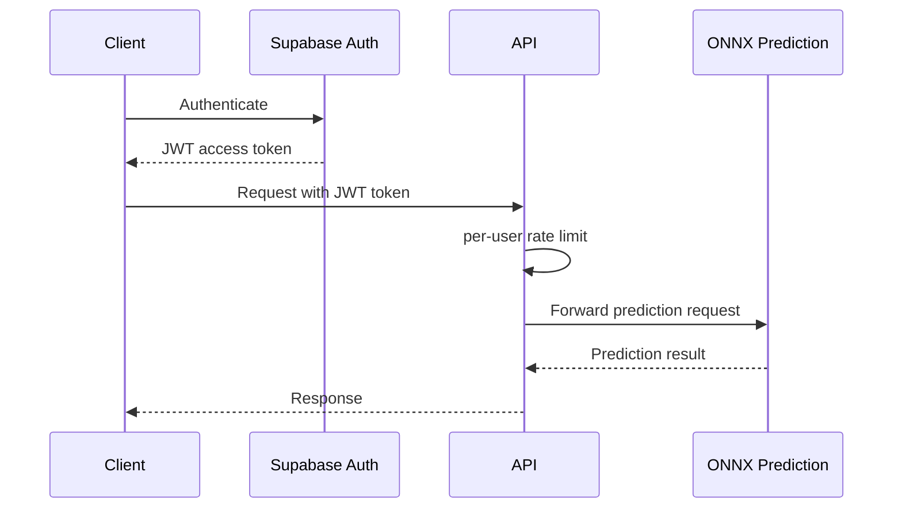

# Pneumonia Detection API

AI-powered API for detecting pneumonia from chest X-ray images. Built with FastAPI and ONNX Runtime, protected by Supabase JWT authentication, and rate limited per authenticated user.


## Medical Disclaimer

This API is for educational and research purposes only. Predictions must never be used as a substitute for professional medical diagnosis or treatment. Always consult qualified healthcare professionals for medical advice.

## Overview

The current architecture is intentionally simpler than previous releases. The prediction endpoint requires a Supabase JWT, and rate limits are applied to the authenticated user identity from the JWT `sub` claim. The old IP, fingerprint, behavioral-analysis, Redis, `/stats`, and `/status` systems were removed in v3.8.0.

Core flow:



## Key Features

- Chest X-ray pneumonia prediction with Standard CNN and EfficientNet-B0 ONNX models.
- Supabase JWT Bearer authentication for `POST /pneumonia/predict`.
- Per-user rate limiting based on the Supabase JWT `sub` claim.
- Supabase-backed rate-limit counters with in-memory fallback.
- Duplicate upload detection with SHA-256 file hashing.
- File validation for image type, size, integrity, and chest X-ray relevance.
- Health and badge endpoints for deployment monitoring.
- Modular FastAPI architecture with dependency injection and startup lifecycle management.

## Breaking Changes in v3.8.0

- Removed `/stats` and `/status`.
- Removed IP-based, fingerprint-based, and behavioral rate limiting.
- Removed Redis and the old multi-backend rate-limit storage layer.
- Rate limiting is now tied to authenticated users, not client IP addresses.
- Unauthenticated clients cannot use `POST /pneumonia/predict`.
- Monitoring should use `/health` or `/badge.json`.

## Project Structure

```text
pneumonia-detection-api/
|-- app/
|   |-- main.py                         # FastAPI app factory and lifespan
|   |-- openapi.py                      # OpenAPI customization
|   |-- version.py                      # Central API version helper
|   |-- api/
|   |   |-- health.py                   # /, /health, /badge.json
|   |   |-- model_info.py               # /pneumonia/model/info
|   |   `-- prediction.py               # /pneumonia/predict
|   |-- core/
|   |   |-- advanced_rate_limiting.py   # Compatibility shim only
|   |   |-- dependencies.py             # Dependency container
|   |   |-- logger.py                   # Logging setup
|   |   |-- middleware_factory.py       # Middleware registration
|   |   |-- settings.py                 # Environment configuration
|   |   |-- startup_manager.py          # Service initialization
|   |   `-- user_rate_limiting.py       # JWT user-based rate limiter
|   |-- middleware/
|   |   `-- security.py                 # Security headers, logging, rate limiting
|   |-- models/                         # Pydantic response and error schemas
|   |-- services/
|   |   `-- prediction.py               # ONNX model loading and inference
|   |-- utils/
|   |   |-- jwt_auth.py                 # Supabase JWT verification
|   |   |-- security.py                 # File hashing and request helpers
|   |   `-- validation.py               # Upload and image validation
|   `-- docs/                           # OpenAPI metadata sections
|-- doc/
|   |-- SUPABASE_JWT_AUTH.md
|   |-- USER_RATE_LIMITING_GUIDE.md
|   `-- SUPABASE_RATE_LIMITS_TABLE.sql
|-- models/                             # ONNX model files and stats
|-- main.py                             # Entrypoint
|-- Dockerfile
|-- docker-compose.yml
|-- render.yaml
|-- requirements.txt
`-- README.md
```

## Quick Start

```bash
git clone https://github.com/IbnuSabilGitHub/Pneumonia-Detection-API.git
cd Pneumonia-Detection-API

python -m venv .venv
. .venv/bin/activate
pip install -r requirements.txt

python main.py
```

Windows PowerShell:

```powershell
python -m venv .venv
.\.venv\Scripts\Activate.ps1
pip install -r requirements.txt
python main.py
```

Docker:

```bash
docker-compose up --build pneumonia-api
```

Base URL:

```text
http://localhost:8000
```

Health check:

```bash
curl http://localhost:8000/health
```

## Supabase Setup

At minimum, configure Supabase before calling the protected prediction endpoint:

```bash
SUPABASE_URL=https://your-project.supabase.co
SUPABASE_ANON_KEY=your-supabase-anon-key
SUPABASE_JWT_VERIFY_AUDIENCE=true
```

For persistent rate-limit counters, create the Supabase `rate_limits` table with:

```text
doc/SUPABASE_RATE_LIMITS_TABLE.sql
```

If Supabase storage is unavailable, the API falls back to in-memory rate-limit storage so legitimate users are not blocked by a storage outage.

## API Endpoints

| Method | Path | Auth | Description |
|---|---|---|---|
| `GET` | `/` | Public | Health check |
| `HEAD` | `/` | Public | Lightweight probe |
| `GET` | `/health` | Public | Health check |
| `HEAD` | `/health` | Public | Lightweight probe |
| `GET` | `/badge.json` | Public | Shields.io-compatible status badge JSON |
| `POST` | `/pneumonia/predict` | Supabase JWT | Analyze a chest X-ray image |
| `GET` | `/pneumonia/model/info` | Public | Return loaded model metadata |
| `GET` | `/docs` | Public | Swagger UI |
| `GET` | `/redoc` | Public | ReDoc |
| `GET` | `/openapi.json` | Public | OpenAPI schema |

Removed endpoints:

```text
/stats
/status
/security/stats
/security/status
```

Use `/health` and `/badge.json` for monitoring.

## Prediction Example

Get an access token from Supabase, then call the API:

```bash
curl -X POST "http://localhost:8000/pneumonia/predict" \
  -H "Authorization: Bearer $SUPABASE_ACCESS_TOKEN" \
  -F "file=@chest_xray.jpg"
```

Python example:

```python
import requests

auth = requests.post(
    "https://your-project.supabase.co/auth/v1/token?grant_type=password",
    headers={
        "apikey": "your-supabase-anon-key",
        "Content-Type": "application/json",
    },
    json={"email": "user@example.com", "password": "password123"},
    timeout=10,
)
token = auth.json()["access_token"]

with open("chest_xray.jpg", "rb") as image:
    response = requests.post(
        "http://localhost:8000/pneumonia/predict",
        headers={"Authorization": f"Bearer {token}"},
        files={"file": ("chest_xray.jpg", image, "image/jpeg")},
        timeout=30,
    )

print(response.status_code)
print(response.json())
```

Example prediction response:

```json
{
  "prediction": "NORMAL",
  "confidence": 0.92,
  "probabilities": {
    "NORMAL": 0.92,
    "PNEUMONIA": 0.08
  },
  "medical_recommendation": "Normal results - maintain regular health checkups",
  "model_info": {
    "model_type": "efficientnet_b0",
    "model_version": "v1.0",
    "architecture": "EfficientNet-B0"
  },
  "disclaimer": "This model is for educational purposes only. Consult a healthcare professional for medical advice."
}
```

## User Rate Limiting

Rate limiting is applied per authenticated Supabase user:

```text
JWT sub claim -> user_id -> request counter -> allow or reject
```

Defaults:

```bash
USER_RATE_LIMITING_ENABLED=true
USER_RATE_LIMIT_MAX_REQUESTS=100
USER_RATE_LIMIT_WINDOW_SIZE=3600
USER_RATE_LIMIT_USE_SUPABASE=true
```

Response headers include rate-limit state:

```http
X-RateLimit-Limit: 100 per 3600s
X-RateLimit-Remaining: 95
X-RateLimit-Reset: 1713340000
X-RateLimit-Window: 3600
X-RateLimit-Type: user
```

When the limit is exceeded, the API returns `429` with a `Retry-After` header.

## Configuration

Common environment variables:

```bash
# Application
APP_NAME="Pneumonia Detection API"
APP_VERSION=3.8.0
DEBUG=false
HOST=0.0.0.0
PORT=8000

# Supabase JWT authentication
SUPABASE_URL=https://your-project.supabase.co
SUPABASE_ANON_KEY=your-supabase-anon-key
SUPABASE_JWT_VERIFY_AUDIENCE=true

# User-based rate limiting
USER_RATE_LIMITING_ENABLED=true
USER_RATE_LIMIT_MAX_REQUESTS=100
USER_RATE_LIMIT_WINDOW_SIZE=3600
USER_RATE_LIMIT_USE_SUPABASE=true

# Prediction
PREDICTION_CONCURRENCY_LIMIT=3

# Upload validation
MAX_FILE_SIZE=10485760
ALLOWED_EXTENSIONS=.jpg,.jpeg,.png
CACHE_DURATION=300
FILE_HASH_CACHE_MAX_SIZE=200

# Models
MODEL_PATH=models/pneumonia_model_standard.onnx
MODEL_STATS_PATH=models/model_stats_standard.json
MODEL_PATH_EFFICIENTNET_B0=models/pneumonia_model_efficientnet_b0.onnx
MODEL_STATS_PATH_EFFICIENTNET_B0=models/model_stats_efficientnet_b0.json

# Security and CORS
TRUSTED_HOSTS=*.onrender.com,localhost,127.0.0.1
CORS_ORIGINS=*
EXCLUDED_PATHS=/health,/,/docs,/redoc,/openapi.json

# Logging
LOG_LEVEL=INFO
LOG_ENABLED=true
```

## Deployment

Render is the primary deployment target in this repository:

```text
Build Command: pip install -r requirements.txt
Start Command: python main.py
```

`render.yaml` is included for Render Blueprint deployment. The app reads `PORT` from the environment, which Render sets automatically for web services.

Docker deployment:

```bash
docker build -t pneumonia-api .
docker run -p 8000:8000 \
  -e SUPABASE_URL="https://your-project.supabase.co" \
  -e SUPABASE_ANON_KEY="your-supabase-anon-key" \
  pneumonia-api
```

Post-deployment checks:

```bash
curl https://your-api.example.com/health
curl https://your-api.example.com/badge.json
curl https://your-api.example.com/pneumonia/model/info
```

## Troubleshooting

`401 MISSING_TOKEN`: Add `Authorization: Bearer <supabase_access_token>` to `POST /pneumonia/predict`.

`401 INVALID_TOKEN`: Verify that `SUPABASE_URL` points to the project that issued the token, and that the token is an access token.

`401 INVALID_AUDIENCE`: Use Supabase's default `authenticated` audience or set `SUPABASE_JWT_VERIFY_AUDIENCE=false` for non-standard tokens.

`429 RATE_LIMIT_EXCEEDED`: Wait until the reset time or increase `USER_RATE_LIMIT_MAX_REQUESTS`.

`409 DUPLICATE_FILE`: The same file hash was uploaded recently. Wait for `CACHE_DURATION` seconds or upload a different image.

`503 MODEL_NOT_LOADED`: Check that the ONNX model files exist under `models/` and that ONNX Runtime installed correctly.

## Documentation

- [Architecture](ARCHITECTURE.md)
- [Supabase JWT Auth](doc/SUPABASE_JWT_AUTH.md)
- [User Rate Limiting](doc/USER_RATE_LIMITING_GUIDE.md)
- [Supabase Rate Limits Table](doc/SUPABASE_RATE_LIMITS_TABLE.sql)
- [Deployment Guide](doc/DEPLOYMENT_GUIDE.md)
- [API Documentation](doc/API_DOCUMENTATION.md)
- [Usage Examples](doc/USAGE_EXAMPLES.md)

Built with FastAPI and ONNX Runtime.

Last updated: 2026-04-15 | Version: 3.8.0
