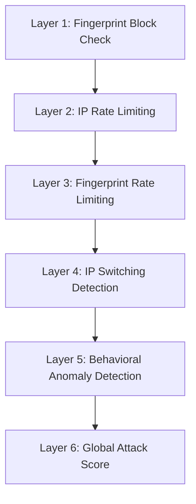

# 🏥 Pneumonia Detection API

Advanced AI powered medical imaging analysis service for detecting pneumonia from chest X-ray images. Built with FastAPI, powered by ONNX, and secured with a multi layer, production grade protection system.


---

## ⚠️ Medical Disclaimer

This API is for educational and research purposes only. Predictions must **NEVER** be used as a substitute for professional medical diagnosis or treatment. Always consult qualified healthcare professionals for medical advice.

---

## 📚 Table of Contents

- [🏥 Pneumonia Detection API](#-pneumonia-detection-api)
  - [⚠️ Medical Disclaimer](#️-medical-disclaimer)
  - [📚 Table of Contents](#-table-of-contents)
  - [🌟 Overview](#-overview)
  - [🚀 Key Features](#-key-features)
  - [🏗️ Architecture](#️-architecture)
  - [⚡ Quick Start](#-quick-start)
  - [📡 API Endpoints](#-api-endpoints)
  - [🛡️ Security \& Rate Limiting](#️-security--rate-limiting)
  - [⚙️ Configuration](#️-configuration)
  - [🌐 Deployment](#-deployment)
  - [🔧 Usage Examples](#-usage-examples)
  - [📊 Monitoring \& Alerting](#-monitoring--alerting)
  - [🔄 Migration: Redis → In-Memory](#-migration-redis--in-memory)
  - [🔗 References](#-references)

---

## 🌟 Overview

The Pneumonia Detection API provides AI inference for chest X-ray images using deep learning (Standard CNN, EfficientNet-B0). It includes enterprise grade security with advanced rate limiting, request fingerprinting, IP switching detection, behavioral analysis, and global attack scoring all optimized for single-instance deployments (e.g., Railway) using in-memory storage by default.

---

## 🚀 Key Features

- AI-Powered Detection
  - Models: Standard CNN and EfficientNet-B0
  - Confidence scoring and class probabilities
  - Medical recommendations included in responses

- Security & Protection
  - **JWT Authentication via Supabase** (Bearer token)
  - Multi-layer advanced rate limiting
  - Request fingerprinting
  - IP switching attack detection
  - Behavioral analysis and file-duplication detection
  - Global attack scoring with dynamic limits
  - Comprehensive security status endpoints

- Operational Excellence
  - Modular, maintainable architecture
  - In-memory storage default (Redis optional)
  - Rich API documentation and examples
  - Optimized for Railway and Docker

---

## 🏗️ Architecture

Clean, modular architecture with clear separation of concerns and production-grade patterns.

Project structure:
```
pneumonia-detection-api/
├── app/
│   ├── __init__.py
│   ├── main.py                         # FastAPI application
│   ├── openapi.py                      # API documentation config
│   ├── api/                            # API routes
│   │   ├── __init__.py
│   │   ├── health.py
│   │   ├── model_info.py
│   │   ├── prediction.py
│   │   ├── stats.py
│   │   └── status.py
│   ├── core/                           # Core & infrastructure
│   │   ├── __init__.py
│   │   ├── advanced_rate_limiting.py   # Backward compatibility
│   │   ├── dependencies.py
│   │   ├── logger.py
│   │   ├── memory_storage.py
│   │   ├── middleware_factory.py
│   │   ├── rate_limiting/              # Modular rate limiting
│   │   ├── redis_storage.py            # Optional Redis backend
│   │   ├── settings.py
│   │   ├── startup_manager.py
│   │   ├── storage_backends.py
│   │   └── storage_factory.py
│   ├── docs/                           # Documentation metadata
│   │   └── sections/
│   ├── middleware/
│   │   ├── __init__.py
│   │   └── security.py
│   ├── models/                         # Pydantic schemas
│   │   ├── __init__.py
│   │   ├── base.py
│   │   ├── error_codes.py
│   │   ├── health_schemas.py
│   │   ├── model_info_schemas.py
│   │   ├── prediction_schemas.py
│   │   └── security_schemes.py
│   ├── services/                       # Business logic
│   │   ├── __init__.py
│   │   └── prediction.py
│   └── utils/                          # Utilities
│       ├── __init__.py
│       ├── custom_exceptions.py
│       ├── exceptions.py
│       ├── get_prediction_service.py
│       ├── security.py
│       └── validation.py
├── doc/                                # Comprehensive documentation
├── models/                             # ONNX model files & stats
├── main.py                             # Entry point
├── docker-compose.yml
├── Dockerfile
├── requirements.txt
├── requirements_dev.txt
└── README.md
```

Recent improvements:
- Refactored middleware and services for maintainability
- Strong error handling and graceful fallbacks
- In-memory default storage with optional Redis support
- Enhanced API docs and schema clarity

---

## ⚡ Quick Start

Clone, install, and run:

```bash
git clone https://github.com/IbnuSabilGitHub/Pneumonia-Detection-API.git
cd Pneumonia-Detection-API

# Option 1: Local Python environment
python -m venv .venv
. .venv/bin/activate  # Linux/Mac
# .venv\Scripts\activate  # Windows

pip install -r requirements.txt
python main.py  # or: uvicorn app.main:app --reload

# Option 2: Docker Compose (recommended)
docker-compose up --build pneumonia-api

# Option 3: Docker (manual)
docker build -t pneumonia-api .
docker run -p 8000:8000 pneumonia-api
```

Base URL
```
http://localhost:8000
```

Health Check
```bash
curl -X GET "http://localhost:8000/health"
```

Basic Prediction
```bash
curl -X POST "http://localhost:8000/pneumonia/predict" \
     -H "Authorization: Bearer $SUPABASE_ACCESS_TOKEN" \
     -H "Content-Type: multipart/form-data" \
     -F "file=@chest_xray.jpg"
```

---

## 📡 API Endpoints

**Health & Monitoring**
- `GET /` or `GET /health`
  - Returns: { status: healthy|partial|unhealthy, model_loaded, version, uptime }
  - Health check with service status and model availability

**Security Management (🔒 Admin Only - Requires Admin JWT)**
- `GET /status` 🔒
  - **Authentication Required**: `Authorization: Bearer <admin_jwt>` header
  - Real-time protection status, attack scores, and current metrics
  - Returns active threats, request rates, blocked fingerprints
  - **Purpose**: Admin monitoring and incident response
- `GET /stats` 🔒
  - **Authentication Required**: `Authorization: Bearer <admin_jwt>` header
  - Comprehensive security analytics dashboard
  - Detailed threat analysis, traffic patterns, and protection effectiveness
  - **Purpose**: Security team analysis and system tuning

**Pneumonia Detection (Core Features)**
- `POST /pneumonia/predict` 🔒
  - **Authentication Required**: `Authorization: Bearer <supabase_jwt>` header
  - Params: `file` (JPG/JPEG/PNG, max 10MB), optional `model=standard|efficientnet_b0`
  - Returns: prediction, confidence, probabilities, medical recommendation, model info
  - **Rate limited**: endpoint-specific limits apply (default: 20 requests per 5 minutes per IP)
- `GET /pneumonia/model/info`
  - Params: optional `model=standard|efficientnet_b0`
  - Returns: model metadata (architecture, input shape, performance metrics)

Example Response (Predict):
```json
{
  "prediction": "NORMAL",
  "confidence": 0.92,
  "probabilities": { "NORMAL": 0.92, "PNEUMONIA": 0.08 },
  "medical_recommendation": "✅ Normal results - maintain regular health checkups",
  "model_version": "v1.0",
  "model_type": "efficientnet_b0",
  "disclaimer": "This model is for educational purposes only. Consult a healthcare professional for medical advice."
}
```

Common Error Responses
- 400 INVALID_FILE_FORMAT, INVALID_IMAGE_CONTENT
- 409 DUPLICATE_FILE
- 413 FILE_TOO_LARGE
- 429 RATE_LIMIT_EXCEEDED
- 503 SERVICE_UNAVAILABLE

---

## 🛡️ Security & Rate Limiting

Why advanced rate limiting?
- Traditional IP-only limits are easy to bypass (VPNs/proxies)
- No browser fingerprint detection
- No behavioral analysis
- No distributed attack detection

Solution: Multi-layer protection with dynamic scoring


Note: The advanced rate limiting module has been refactored into `app.core.rate_limiting` with a backward-compatible shim at `app.core.advanced_rate_limiting`. See `doc/RATE_LIMITING_REFACTOR.md` for details.

Default thresholds (tunable):
```python
WINDOW_SIZE = 60                      # seconds
MAX_REQUESTS_PER_IP = 5               # per minute
MAX_FINGERPRINT_REQUESTS = 2          # per minute
IP_SWITCHING_THRESHOLD = 3            # same fingerprint from 3+ IPs
GLOBAL_ATTACK_THRESHOLD = 0.6
ATTACK_BLOCK_DURATION = 300           # seconds
BOT_BEHAVIOR_VARIANCE = 0.1
```

What’s protected
- POST /pneumonia/predict: full protection
- Security endpoints & health: generally unthrottled or relaxed limits

Security headers (examples)
```
X-Content-Type-Options: nosniff
X-Frame-Options: DENY
X-XSS-Protection: 1; mode=block
X-RateLimit-Limit: 5
X-RateLimit-Remaining: 3
X-RateLimit-Reset: 1625097600
Retry-After: 60
```

---

## ⚙️ Configuration

Environment Variables (common)
```bash
# App Configuration
APP_VERSION=3.5.1
DEBUG=false
HOST=0.0.0.0
PORT=8000

# JWT Authentication (Supabase)
JWT_AUTH_ENABLED=true                   # Master toggle for JWT auth
SUPABASE_URL=https://your-project.supabase.co
SUPABASE_JWT_SECRET=your-jwt-secret     # Settings → API → JWT Secret
SUPABASE_ANON_KEY=your-anon-key         # Optional, for reference
JWT_ALGORITHM=HS256                     # Default Supabase algorithm
SUPABASE_JWT_VERIFY_AUDIENCE=true       # Verify 'aud' claim

# Admin Security (for /stats and /status endpoints)
# Supports BOTH JWT admin role AND legacy API key
# Generate with: openssl rand -hex 32
ADMIN_API_KEY=your-secure-admin-api-key-here
ENABLE_PUBLIC_STATS=false    # NOT RECOMMENDED for production
ENABLE_PUBLIC_STATUS=false   # NOT RECOMMENDED for production

# Storage Backend (default: memory)
STORAGE_BACKEND=memory   # Options: memory | redis

# Basic Rate Limiting (production defaults)
MAX_REQUESTS_PER_IP=100                 # Per 5-minute window
MAX_FINGERPRINT_REQUESTS=50             # Per fingerprint per window
RATE_LIMIT_WINDOW_SIZE=300              # 5 minutes

# Advanced Rate Limiting
ADVANCED_RATE_LIMITING_ENABLED=true
IP_SWITCHING_THRESHOLD=5                # Same fingerprint from N+ IPs
SUSPICIOUS_IP_CHANGES_THRESHOLD=10      # Distributed attack threshold
GLOBAL_ATTACK_THRESHOLD="0.7"          # Attack score (0.0-1.0)

# Block Durations (seconds)
ATTACK_BLOCK_DURATION=300               # 5 minutes
FINGERPRINT_BLOCK_DURATION=600          # 10 minutes

# Detection Windows (seconds)
IP_SWITCHING_DETECTION_WINDOW=300       # 5 minutes
BEHAVIORAL_ANALYSIS_WINDOW=600          # 10 minutes
GLOBAL_ATTACK_SCORE_WINDOW=900          # 15 minutes

# Endpoint-Specific Limits (for /predict)
PREDICTION_CONCURRENCY_LIMIT=4          # Max concurrent inferences
PREDICTION_MAX_REQUESTS_PER_IP=20       # Per endpoint per window
PREDICTION_RATE_WINDOW=300              # Window for endpoint quota

# In-Memory Storage (when STORAGE_BACKEND=memory)
MEMORY_MAX_SIZE=1000
MEMORY_CLEANUP_INTERVAL=180             # 3 minutes
MEMORY_DEFAULT_TTL=1800                 # 30 minutes

# Redis Configuration (when STORAGE_BACKEND=redis)
REDIS_URL=redis://localhost:6379
REDIS_HOST=localhost
REDIS_PORT=6379
REDIS_PASSWORD=your_secure_password     # Optional
REDIS_DB=0
REDIS_MAX_CONNECTIONS=50

# Security & CORS
TRUSTED_HOSTS="*.railway.app,localhost,127.0.0.1"
CORS_ORIGINS="*"
EXCLUDED_PATHS="/health,/,/docs,/redoc,/openapi.json"

# File Upload
MAX_FILE_SIZE=10485760                  # 10MB in bytes
ALLOWED_EXTENSIONS=".jpg,.jpeg,.png"
CACHE_DURATION=300                      # File hash cache (5 minutes)
```

High-Security preset (strict limits):
```bash
MAX_REQUESTS_PER_IP=30                  # Reduced from 100
MAX_FINGERPRINT_REQUESTS=20             # Reduced from 50
IP_SWITCHING_THRESHOLD=3                # Reduced from 5
GLOBAL_ATTACK_THRESHOLD="0.5"          # Reduced from 0.7
PREDICTION_MAX_REQUESTS_PER_IP=10       # Reduced from 20
ATTACK_BLOCK_DURATION=600               # 10 minutes instead of 5
```

Development preset (relaxed limits):
```bash
MAX_REQUESTS_PER_IP=200
MAX_FINGERPRINT_REQUESTS=100
IP_SWITCHING_THRESHOLD=10
GLOBAL_ATTACK_THRESHOLD="0.9"
PREDICTION_MAX_REQUESTS_PER_IP=50
ADVANCED_RATE_LIMITING_ENABLED=false    # Disable for testing
```

---

## 🌐 Deployment

Option 1: Render (Recommended)
```
1. Fork or push repository to GitHub
2. Open Render Dashboard → New → Web Service
3. Connect the repository
4. Build Command: pip install -r requirements.txt
5. Start Command: python main.py
6. (Optional) Set environment variables (see Configuration)
7. Deploy (autoDeploy=true for subsequent pushes)
```
Default Render Env Vars:
```
PORT=10000
PYTHON_VERSION=3.11
STORAGE_BACKEND=memory
APP_VERSION=3.4.3
```

Option 2: Docker Compose (recommended for self-hosting)
```bash
# In-memory storage (default)
docker-compose up --build pneumonia-api

# With Nginx reverse proxy
docker-compose --profile production up --build

# Custom environment
docker-compose up --build -e STORAGE_BACKEND=memory -e MAX_REQUESTS_PER_IP=50
```

Option 3: Docker (manual)
```bash
docker build -t pneumonia-api:v3.4.2 .
docker run -p 8000:8000 -e APP_VERSION=3.4.2 pneumonia-api:v3.4.2
```

Option 4: Heroku
```bash
heroku login
heroku create your-app-name
git push heroku main
```

Option 5: Local Development
```bash
# Windows
.\.venv\Scripts\Activate.ps1
# Linux/Mac
# source .venv/bin/activate

pip install -r requirements.txt
python main.py
```

Post-deployment verification
- GET /health → status, model_loaded, version, uptime
- GET /status → active, metrics (🔒 requires ADMIN_API_KEY)
- GET /docs → interactive docs
- GET /pneumonia/model/info → model stats

---

## 🔧 Usage Examples

cURL
```bash
# Health
curl -X GET "http://localhost:8000/health"

# Predict (standard) — 🔒 JWT required
curl -X POST "http://localhost:8000/pneumonia/predict" \
  -H "Authorization: Bearer $SUPABASE_ACCESS_TOKEN" \
  -H "Content-Type: multipart/form-data" \
  -F "file=@chest_xray.jpg"

# Predict (EfficientNet-B0) — 🔒 JWT required
curl -X POST "http://localhost:8000/pneumonia/predict?model=efficientnet_b0" \
  -H "Authorization: Bearer $SUPABASE_ACCESS_TOKEN" \
  -H "Content-Type: multipart/form-data" \
  -F "file=@chest_xray.jpg"

# Model info
curl -X GET "http://localhost:8000/pneumonia/model/info?model=standard"

# Security status (🔒 ADMIN ONLY — JWT admin role required)
curl -X GET "http://localhost:8000/status" \
  -H "Authorization: Bearer $ADMIN_JWT_TOKEN"

# Security stats (🔒 ADMIN ONLY — JWT admin role required)
curl -X GET "http://localhost:8000/stats" \
  -H "Authorization: Bearer $ADMIN_JWT_TOKEN"
```

Python (requests)
```python
import requests

# Step 1: Get Supabase access token
auth = requests.post(
    "https://your-project.supabase.co/auth/v1/token?grant_type=password",
    headers={"apikey": "your-anon-key", "Content-Type": "application/json"},
    json={"email": "user@example.com", "password": "password123"},
    timeout=10,
)
token = auth.json()["access_token"]

# Step 2: Predict with JWT
with open("chest_xray.jpg", "rb") as f:
    r = requests.post(
        "http://localhost:8000/pneumonia/predict",
        headers={"Authorization": f"Bearer {token}"},
        files={"file": ("chest_xray.jpg", f, "image/jpeg")},
        params={"model": "efficientnet_b0"},
        timeout=30
    )
print(r.status_code, r.json())
```


More examples: Python async, Browser fetch, Java, C#, PHP available in USAGE_EXAMPLES.

---

## 📊 Monitoring & Alerting

Key metrics
- Requests per minute, success rate, response times
- Global attack score, blocked requests, unique IP count
- Memory/CPU usage, cache hit rate

Suggested alert thresholds
- Attack Score: warn > 0.7, critical > 0.9
- Blocked Rate: warn > 20%, critical > 50%
- Unique IPs/min: warn > 10, critical > 20
- Response Time: warn > 100ms, critical > 500ms

Security status sample
```json
{
  "service": "Pneumonia Detection API",
  "security_status": "active",
  "advanced_protection": {
    "global_attack_score": 0.15,
    "requests_per_minute": 23,
    "recent_unique_ips": 8,
    "blocked_fingerprints": 2,
    "storage_type": "memory"
  }
}
```

---

## 🔄 Migration: Redis → In-Memory

Why migrate?
- Simpler deployment (single service)
- Lower memory and latency
- Perfect for Railway and education
- Zero external dependencies

What changed
- Default storage_backend: redis → memory
- Optional Redis dependency
- Storage factory supports graceful fallback
- Updated docs, deployment, and tests

Performance improvements
- Memory: ~80MB → ~30MB (−62.5%)
- Response overhead: +2–5ms → +0.1ms (−95%)
- Startup: 2–5s → <1s (−80%)
- Dependencies: 15 → 10 (−33%)

When to use Redis again
- >1000 concurrent users
- Multi-instance behind a load balancer
- Need persistence across restarts
- Advanced analytics and distributed rate limiting

How to re-enable Redis

For single-instance with external Redis:
```bash
# 1. Install Redis dependency
pip install redis>=5.0.0

# 2. Set environment variables
export STORAGE_BACKEND=redis
export REDIS_URL=redis://localhost:6379
export REDIS_PASSWORD=your_password  # if needed
export REDIS_DB=0

# 3. Run application
python main.py
```

For multi-instance production with Redis:
```yaml
# docker-compose.yml
version: '3.8'
services:
  redis:
    image: redis:7-alpine
    restart: unless-stopped
    command: redis-server --requirepass your_secure_password
    ports:
      - "6379:6379"
    volumes:
      - redis_data:/data
    healthcheck:
      test: ["CMD", "redis-cli", "--raw", "incr", "ping"]
      interval: 10s
      timeout: 3s
      retries: 3

  pneumonia-api:
    build: .
    depends_on:
      redis:
        condition: service_healthy
    environment:
      STORAGE_BACKEND: redis
      REDIS_URL: redis://:your_secure_password@redis:6379/0
    # ... other config

volumes:
  redis_data:
```

Then run:
```bash
docker-compose up --build
```

When to use Redis:
- Multiple API instances (horizontal scaling)
- Need persistent rate limiting across restarts
- Advanced analytics and attack pattern analysis
- Production environments with >1000 concurrent users

---

## 🛠️ Troubleshooting

Common issues
- **Invalid file**: Ensure JPG/JPEG/PNG; max 10MB; valid X-ray content
- **Rate limit 429**: Two types of limits can trigger this
  - Global limit: Wait for window reset or implement exponential backoff
  - Endpoint-specific limit: `/predict` has separate tighter limits (default 20/5min)
  - Check headers: `X-RateLimit-Limit-Predict`, `X-RateLimit-Remaining-Predict`
- **Slow responses**: Reduce image size; choose Standard model; check CPU/memory
- **Model not loading**: Verify ONNX files; ONNX Runtime installed; check logs
- **Benchmark all 429s**: Likely endpoint quota exhausted; wait 5 minutes or increase `PREDICTION_MAX_REQUESTS_PER_IP`

Debug tips
```bash
curl http://localhost:8000/health | jq

# Admin endpoints require admin JWT
curl -H "Authorization: Bearer YOUR_ADMIN_JWT" http://localhost:8000/status | jq
curl -H "Authorization: Bearer YOUR_ADMIN_JWT" http://localhost:8000/stats | jq

tail -f logs/security.log | grep "BLOCKED\|ATTACK"
```

False positives/negatives
- Tune thresholds (increase/decrease limits)
- Consider whitelisting legitimate patterns
- Review blocked fingerprints weekly; analyze attack patterns monthly

---

## 🔗 References

- Supabase Auth Docs: https://supabase.com/docs/guides/auth
- JWT Authentication Guide: [doc/SUPABASE_JWT_AUTH.md](doc/SUPABASE_JWT_AUTH.md)
- OWASP Rate Limiting Guide: https://owasp.org/www-community/controls/Blocking_Brute_Force_Attacks
- RFC 6585 - HTTP 429: https://tools.ietf.org/html/rfc6585
- Cloudflare Rate Limiting: https://developers.cloudflare.com/fundamentals/api/get-started/requests-per-minute
- NIST Cybersecurity Framework: https://www.nist.gov/cyberframework

Built with FastAPI | Powered by ONNX
Last updated: 2025-03-04 | Version: 3.6.0