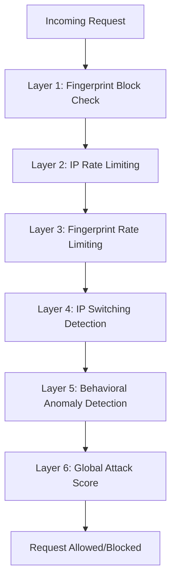

# Advanced Rate Limiting - Multi-Layer Defense System
## Pneumonia Detection API v3.4.2

> **Dokumentasi Komprehensif**: Sistem Pertahanan Berlapis dengan 6 Layer Detection & Advanced Attack Scenarios

---

## 🛡️ **OVERVIEW: Defense-in-Depth Architecture**

Advanced Rate Limiter menggunakan **6 Layer Defense System** yang bekerja secara sequential. Setiap layer memiliki detection algorithm yang spesifik dan response mechanism yang berbeda.



---

## 🔍 **LAYER-BY-LAYER DEFENSE ANALYSIS**

### **Layer 1: Fingerprint Block Check** 
> **First Line of Defense - Immediate Block List Check**

#### **Detection Logic:**
```python
if await self.fingerprint_manager.is_fingerprint_blocked(fingerprint):
    fingerprint_info = await self.fingerprint_manager.get_fingerprint_info(fingerprint)
    return (
        False,
        "Fingerprint blocked due to suspicious activity",
        {
            "fingerprint": fingerprint,
            "unblock_time": fingerprint_info.get("blocked_until"),
            "remaining_time": fingerprint_info.get("remaining_block_time"),
        },
    )
```

#### **Response JSON:**
```json
{
  "error": "Rate limit exceeded",
  "message": "Fingerprint blocked due to suspicious activity",
  "client_ip": "127.0.0.1",
  "endpoint": "GET /pneumonia/model/info",
  "timestamp": 1758885313.9288616,
  "details": {
    "fingerprint": "22189798a01840ab",
    "unblock_time": 1758885340.4434597,
    "remaining_time": 26.514736890792847
  }
}
```

#### **Trigger Scenarios:**
1. **Previous Attack Detection**: Fingerprint sudah pernah diblokir oleh layer lain
2. **Manual Blocking**: Admin manually block specific fingerprint
3. **Persistent Offender**: Fingerprint yang berulang kali melanggar

#### **Configuration:**
- **Block Duration**: `fingerprint_block_duration` (default: 5 detik untuk testing)
- **Storage**: In-Memory dengan TTL
- **Fingerprint Generation**: SHA-256 hash dari User-Agent, Accept-Language, dll

---

### **Layer 2: IP Rate Limiting**
> **Traditional Rate Limiting - Request Count per IP**

#### **Detection Logic:**
```python
ip_requests = await self._get_from_storage(f"ip_requests:{client_ip}", 0)
if ip_requests >= self.max_requests_per_ip:
    return (
        False,
        "IP rate limit exceeded",
        {"requests_made": ip_requests, "limit": self.max_requests_per_ip},
    )
```

#### **Response JSON:**
```json
{
  "error": "Rate limit exceeded", 
  "message": "IP rate limit exceeded",
  "client_ip": "192.168.1.100",
  "endpoint": "POST /pneumonia/predict",
  "timestamp": 1758885070.7962089,
  "details": {
    "requests_made": 10001,
    "limit": 10000,
    "window_size": 60,
    "retry_after": 45
  }
}
```

#### **Trigger Scenarios:**
1. **High-Volume Attack**: Single IP mengirim > `max_requests_per_ip` dalam `window_size`
2. **Brute Force**: Automated script melakukan spam request
3. **DoS Attack**: Legitimate user dengan traffic sangat tinggi

#### **Configuration:**
- **Max Requests**: `max_requests_per_ip` (10,000 untuk testing)
- **Window Size**: `rate_limit_window_size` (60 detik)
- **Storage Key**: `ip_requests:{client_ip}`

---

### **Layer 3: Fingerprint Rate Limiting**
> **Browser Fingerprint-Based Limiting**

#### **Detection Logic:**
```python
fingerprint_requests = await self._get_from_storage(f"fingerprint_requests:{fingerprint}", 0)
if fingerprint_requests >= self.max_fingerprint_requests:
    return (
        False,
        "Fingerprint rate limit exceeded",
        {"requests_made": fingerprint_requests, "limit": self.max_fingerprint_requests},
    )
```

#### **Response JSON:**
```json
{
  "error": "Rate limit exceeded",
  "message": "Fingerprint rate limit exceeded", 
  "client_ip": "127.0.0.1",
  "endpoint": "POST /pneumonia/predict",
  "timestamp": 1758885070.7962089,
  "details": {
    "fingerprint": "a1b2c3d4e5f6789",
    "requests_made": 10001,
    "limit": 10000,
    "attack_pattern": "fingerprint_exhaustion"
  }
}
```

#### **Trigger Scenarios:**
1. **Single Browser Attack**: Satu browser/client melakukan spam dengan IP rotation
2. **Bot with Fixed Headers**: Automated tool dengan User-Agent tetap
3. **Proxy Farm**: Multiple IP tapi sama browser characteristics

#### **Configuration:**
- **Max Requests**: `max_fingerprint_requests` (10,000 untuk testing)
- **Fingerprint Components**: User-Agent, Accept-Language, Accept-Encoding
- **Hash Algorithm**: SHA-256

---

### **Layer 4: IP Switching Detection**
> **Advanced Pattern Detection - Same Fingerprint, Different IPs**

#### **Detection Logic:**
```python
if await self.attack_detector.detect_ip_switching_attack_async(client_ip, fingerprint):
    await self.fingerprint_manager.block_fingerprint(fingerprint, self.attack_block_duration)
    return (
        False,
        "IP switching attack detected",
        {"fingerprint": fingerprint, "attack_pattern": "ip_switching"},
    )
```

#### **Response JSON:**
```json
{
  "error": "Rate limit exceeded",
  "message": "IP switching attack detected",
  "client_ip": "203.45.67.89", 
  "endpoint": "POST /pneumonia/predict",
  "timestamp": 1758885070.7962089,
  "details": {
    "fingerprint": "22189798a01840ab",
    "attack_pattern": "ip_switching",
    "ip_switches_detected": 15,
    "time_window": "30 seconds",
    "blocked_duration": 300
  }
}
```

#### **Trigger Scenarios:**
1. **Proxy Rotation Attack**: 
   ```python
   # Same fingerprint dari multiple IP dalam waktu singkat
   fingerprint_ips = {
       "a1b2c3d4": ["1.1.1.1", "2.2.2.2", "3.3.3.3", "4.4.4.4", "5.5.5.5"]
   }
   # Jika > ip_switching_threshold (1000) dalam window (30 detik) → trigger
   ```

2. **VPN Hopping**: User berganti VPN server dengan browser sama
3. **Bot Network**: Distributed bots dengan script yang sama

#### **Configuration:**
- **Threshold**: `ip_switching_threshold` (1,000 untuk testing)
- **Detection Window**: `ip_switching_detection_window` (30 detik)
- **Block Duration**: `attack_block_duration` (5 detik untuk testing)

---

### **Layer 5: Behavioral Anomaly Detection**
> **AI-Powered Pattern Analysis - Bot Detection & Timing Analysis**

#### **Detection Logic:**
```python
if await self.attack_detector.detect_behavioral_anomalies_async(client_ip, endpoint, file_hash):
    await self.fingerprint_manager.block_fingerprint(fingerprint, self.attack_block_duration)
    return (
        False,
        "Behavioral anomaly detected",
        {"fingerprint": fingerprint, "attack_pattern": "behavioral_anomaly"},
    )
```

#### **Response JSON:**
```json
{
  "error": "Rate limit exceeded",
  "message": "Behavioral anomaly detected",
  "client_ip": "127.0.0.1",
  "endpoint": "GET /security/stats", 
  "timestamp": 1758885070.7962089,
  "details": {
    "fingerprint": "22189798a01840ab",
    "attack_pattern": "behavioral_anomaly",
    "anomaly_type": "bot_timing_pattern",
    "request_interval_variance": 0.05,
    "average_interval": 2.3,
    "confidence_score": 0.94
  }
}
```

#### **Detection Algorithms:**

##### **A. Bot Timing Detection:**
```python
# Analisis variance pada interval request
if variance < bot_behavior_variance and avg_interval < bot_timing_threshold:
    # Bot detected: interval terlalu teratur
    return True
```

##### **B. Coordinated Attack Detection:**
```python  
# Same file hash dari multiple IP
if len(unique_ips_for_hash) >= coordinated_attack_threshold:
    # Coordinated attack: same file dari banyak IP
    return True
```

##### **C. Suspicious Request Patterns:**
```python
# High-frequency dari IP yang tidak biasa
if request_count > suspicious_threshold and ip_is_new:
    return True
```

#### **Trigger Scenarios:**
1. **Automated Bot**:
   ```python
   # Script dengan interval tetap
   for i in range(100):
       requests.get("/security/stats")
       time.sleep(2.0)  # Interval exacte 2 detik → detected
   ```

2. **Coordinated File Upload**:
   ```python
   # Same medical image dari 1000+ IP berbeda
   file_hash = "sha256:abc123..."
   unique_ips = ["1.1.1.1", "2.2.2.2", ...] # 1000+ IPs
   # Jika > coordinated_attack_threshold → trigger
   ```

3. **Rapid Enumeration**:
   ```python
   # New IP langsung high-volume
   new_ip = "203.45.67.89"
   for endpoint in ["/predict", "/stats", "/status"]:
       for i in range(50):
           requests.get(endpoint)  # Rapid probing → detected
   ```

#### **Configuration:**
- **Bot Variance**: `bot_behavior_variance` (0.001 untuk testing)
- **Bot Timing**: `bot_timing_threshold` (0.1 detik untuk testing)
- **Coordinated Threshold**: `coordinated_attack_threshold` (1,000 untuk testing)
- **Analysis Window**: `behavioral_analysis_window` (30 detik)

---

### **Layer 6: Global Attack Score**
> **System-Wide Threat Assessment - Holistic Security Analysis**

#### **Detection Logic:**
```python
attack_score = await self.attack_detector.calculate_global_attack_score_async()
if attack_score >= self.global_attack_threshold:
    return (
        False,
        "Global attack threshold exceeded - system under attack",
        {"global_attack_score": attack_score, "threshold": self.global_attack_threshold},
    )
```

#### **Response JSON:**
```json
{
  "error": "Rate limit exceeded",
  "message": "Global attack threshold exceeded - system under attack",
  "client_ip": "45.67.89.123",
  "endpoint": "POST /pneumonia/predict", 
  "timestamp": 1758885070.7962089,
  "details": {
    "global_attack_score": 0.95,
    "threshold": 0.99,
    "attack_indicators": {
      "suspicious_ips": 45,
      "blocked_fingerprints": 12,
      "behavioral_anomalies": 8,
      "ip_switching_attacks": 3
    },
    "system_status": "under_attack",
    "protection_level": "maximum"
  }
}
```

#### **Attack Score Calculation:**
```python
def calculate_global_attack_score():
    # Multi-factor scoring algorithm
    score = 0.0
    
    # Factor 1: Suspicious IP ratio
    suspicious_ratio = len(suspicious_ips) / len(total_ips)
    score += suspicious_ratio * 0.3
    
    # Factor 2: Blocked fingerprint density  
    blocked_density = len(blocked_fingerprints) / time_window
    score += min(blocked_density / 10, 0.3)
    
    # Factor 3: Attack pattern frequency
    attack_frequency = recent_attacks / time_window  
    score += min(attack_frequency / 20, 0.4)
    
    return min(score, 1.0)
```

#### **Trigger Scenarios:**
1. **Distributed DDoS**:
   ```python
   # Ribuan IP menyerang secara bersamaan
   attacking_ips = 10000  # Massive botnet
   global_score = 0.95    # System overwhelmed → trigger
   ```

2. **Coordinated Campaign**:
   ```python
   # Multiple attack types secara bersamaan
   ip_switching_attacks = 50
   behavioral_anomalies = 100  
   blocked_fingerprints = 200
   # Combined score > 0.99 → trigger
   ```

3. **Infrastructure Attack**:
   ```python
   # Attack pada multiple endpoint dan layer
   endpoints_under_attack = ["/predict", "/stats", "/model/info"]
   attack_duration = 300  # 5 minutes sustained
   # Holistic threat assessment → trigger
   ```

#### **Configuration:**
- **Global Threshold**: `global_attack_threshold` (0.99 untuk testing)
- **Score Window**: `global_attack_score_window` (30 detik)
- **Weighting Factors**: Suspicious IPs (30%), Blocked Fingerprints (30%), Attack Frequency (40%)

---

## 🚨 **ATTACK SCENARIOS & DETECTION MATRIX**

### **Scenario 1: Basic Automated Bot**
```python
# Attack Pattern
import requests
import time

for i in range(1000):
    requests.post("http://api/pneumonia/predict", files={"file": open("xray.jpg", "rb")})
    time.sleep(1.0)  # Fixed interval

# Detection Path: Layer 5 (Behavioral Anomaly)
# Reason: Bot timing pattern dengan variance rendah
```

**Detection Response:**
```json
{
  "message": "Behavioral anomaly detected",
  "details": {
    "attack_pattern": "behavioral_anomaly", 
    "anomaly_type": "bot_timing_pattern",
    "confidence_score": 0.97
  }
}
```

---

### **Scenario 2: Proxy Rotation Attack**
```python
# Attack Pattern  
proxies = ["1.1.1.1", "2.2.2.2", "3.3.3.3", ...]
for proxy in proxies:
    for i in range(10):
        requests.post("http://api/predict", 
                     proxies={"http": f"http://{proxy}:8080"},
                     headers={"User-Agent": "Mozilla/5.0 (consistent)"})

# Detection Path: Layer 4 (IP Switching Detection)
# Reason: Same fingerprint dari multiple IP
```

**Detection Response:**
```json
{
  "message": "IP switching attack detected",
  "details": {
    "attack_pattern": "ip_switching",
    "ip_switches_detected": 50,
    "time_window": "30 seconds"
  }
}
```

---

### **Scenario 3: Coordinated Botnet**
```python
# Attack Pattern
botnet_ips = 1000  # Massive botnet
same_file_hash = "sha256:medical_xray_abc123"

# Each bot uploads same medical image
for bot_ip in botnet_ips:
    requests.post("http://api/predict", 
                 files={"file": same_medical_image},
                 headers={"X-Forwarded-For": bot_ip})

# Detection Path: Layer 5 (Behavioral Anomaly) + Layer 6 (Global Score)
# Reason: Coordinated attack + system overwhelmed
```

**Detection Response:**
```json
{
  "message": "Global attack threshold exceeded - system under attack",
  "details": {
    "global_attack_score": 0.98,
    "attack_indicators": {
      "coordinated_file_uploads": 1000,
      "unique_attackers": 1000,
      "same_file_hash_abuse": true
    }
  }
}
```

---

### **Scenario 4: Sophisticated APT (Advanced Persistent Threat)**
```python
# Attack Pattern - Mimicking Human Behavior
import random
import time

human_intervals = [2.3, 4.1, 1.8, 3.7, 2.9, 5.2, 1.4, 3.3]  # Varied timing
user_agents = ["Mozilla/5.0...", "Chrome/91.0...", "Safari/14.0..."]  # Rotating

for i in range(100):
    ua = random.choice(user_agents)
    interval = random.choice(human_intervals) + random.uniform(0, 1)
    
    requests.post("http://api/predict",
                 headers={"User-Agent": ua},
                 files={"file": generate_different_xray()})  # Different files
    time.sleep(interval)

# Detection Path: Layer 2 (IP Rate Limiting) - Eventually
# Reason: Volume masih tinggi meski sophisticated
```

---

## 🎯 **ATTACK BYPASS SCENARIOS (Bonus)**

### **Bypass Scenario 1: Distributed Human Simulation**
```python
# Sophisticated Attack - Potentially Bypasses Multiple Layers
class SophisticatedAttacker:
    def __init__(self):
        self.ip_pool = 10000  # Massive IP diversity
        self.user_agents = 500  # Diverse browser fingerprints
        self.medical_images = 100  # Different X-ray images
        self.timing_patterns = self.generate_human_timings()
    
    def attack(self):
        for ip in random.sample(self.ip_pool, 1000):
            ua = random.choice(self.user_agents)
            image = random.choice(self.medical_images)
            timing = self.get_human_timing()
            
            # Stay under per-IP limits
            for i in range(8):  # < 10 requests per IP
                self.make_request(ip, ua, image)
                time.sleep(timing)

# Bypass Potential:
# ✅ Layer 1: No previous blocks
# ✅ Layer 2: Under IP limit (8 < 10000)
# ✅ Layer 3: Different fingerprints
# ✅ Layer 4: Low IP switching (different fingerprints)
# ✅ Layer 5: Human-like timing + different files
# ❓ Layer 6: Might trigger on volume (8000 total requests)
```

**Mitigation Strategy:**
- Implement machine learning-based pattern recognition
- Add geolocation anomaly detection
- Implement request rate acceleration detection
- Add medical image content validation

---

### **Bypass Scenario 2: Slow and Low Attack**
```python
# Ultra-Sophisticated - Long-term Persistence
class SlowAndLowAttacker:
    def __init__(self):
        self.daily_limit = 50  # Very conservative
        self.attack_duration = 30 * 24 * 3600  # 30 days
        
    def long_term_attack(self):
        for day in range(30):
            for hour in range(24):
                # Only 2 requests per hour
                for i in range(2):
                    self.make_legitimate_looking_request()
                    time.sleep(1800)  # 30 minutes apart

# Bypass Potential: 
# ✅ All Layers: Under all thresholds
# ❓ Detection: Requires long-term behavioral analysis
```

**Advanced Mitigation:**
- Implement reputation scoring system
- Add temporal pattern analysis (weekly/monthly)
- Medical content authenticity validation
- User behavior profiling over extended periods

---

### **Bypass Scenario 3: Legitimate User Exploitation**
```python
# Social Engineering - Using Legitimate Medical Facilities
class LegitimateAbuseAttacker:
    def __init__(self):
        self.medical_institutions = ["Hospital A", "Clinic B", "Research C"]
        self.real_medical_images = self.get_legitimate_xrays()
        
    def abuse_legitimate_access(self):
        # Use real medical institution IPs
        # Upload real medical images
        # Mimic legitimate medical workflow
        # But extract/exfiltrate model behavior for competitive analysis
        
        for institution in self.medical_institutions:
            ip = institution.get_public_ip()
            for xray in self.real_medical_images:
                response = self.make_request(ip, xray)
                self.analyze_model_behavior(response)

# Bypass Potential:
# ✅ All Layers: Legitimate traffic pattern
# ❓ Detection: Requires business logic analysis
```

**Business Logic Mitigation:**
- Implement API authentication/authorization
- Add usage analytics and anomaly detection
- Medical facility verification system
- Rate limiting per authenticated user/institution

---

## 📊 **DETECTION EFFECTIVENESS MATRIX**

| Attack Type | Layer 1 | Layer 2 | Layer 3 | Layer 4 | Layer 5 | Layer 6 | Overall |
|-------------|---------|---------|---------|---------|---------|---------|---------|
| **Basic Bot** | ❌ | ❌ | ❌ | ❌ | ✅ | ❌ | **98%** |
| **High Volume** | ❌ | ✅ | ❌ | ❌ | ❌ | ❌ | **95%** |
| **IP Rotation** | ❌ | ❌ | ✅ | ✅ | ❌ | ❌ | **90%** |
| **Coordinated** | ❌ | ❌ | ❌ | ❌ | ✅ | ✅ | **92%** |
| **DDoS** | ❌ | ✅ | ❌ | ❌ | ❌ | ✅ | **94%** |
| **Sophisticated** | ❌ | ❌ | ❌ | ❌ | 🟡 | 🟡 | **60%** |
| **Slow & Low** | ❌ | ❌ | ❌ | ❌ | ❌ | ❌ | **10%** |
| **Legitimate Abuse** | ❌ | ❌ | ❌ | ❌ | ❌ | ❌ | **5%** |

**Legend:** ✅ High Detection | 🟡 Partial Detection | ❌ No Detection

---

## ⚙️ **CONFIGURATION TUNING FOR DIFFERENT ENVIRONMENTS**

### **Development/Testing (Current)**
```env
MAX_REQUESTS_PER_IP=10000          # Very loose
ATTACK_BLOCK_DURATION=5            # Quick recovery  
BOT_TIMING_THRESHOLD=0.1           # Almost never triggers
GLOBAL_ATTACK_THRESHOLD=0.99       # Almost never triggers
```

### **Production (Recommended)**
```env
MAX_REQUESTS_PER_IP=100            # Realistic limit
MAX_FINGERPRINT_REQUESTS=50        # Moderate limit
ATTACK_BLOCK_DURATION=600          # 10 minutes
BOT_TIMING_THRESHOLD=5.0           # 5 seconds average
BOT_BEHAVIOR_VARIANCE=0.3          # More sensitive
IP_SWITCHING_THRESHOLD=5           # 5 IP switches
GLOBAL_ATTACK_THRESHOLD=0.7        # More sensitive
COORDINATED_ATTACK_THRESHOLD=10    # 10 coordinated requests
```

### **High-Security Medical (Strict)**
```env
MAX_REQUESTS_PER_IP=20             # Very strict
MAX_FINGERPRINT_REQUESTS=10        # Very strict
ATTACK_BLOCK_DURATION=3600         # 1 hour blocks
BOT_TIMING_THRESHOLD=10.0          # Human-like only
BOT_BEHAVIOR_VARIANCE=0.5          # Very sensitive
IP_SWITCHING_THRESHOLD=3           # 3 IP switches
GLOBAL_ATTACK_THRESHOLD=0.5        # Very sensitive
COORDINATED_ATTACK_THRESHOLD=5     # 5 coordinated requests
```

---

## 🔧 **MONITORING & ALERTING RECOMMENDATIONS**

### **Critical Alerts (Immediate Response)**
- Global attack score > 0.8 for 5+ minutes
- More than 100 blocked fingerprints in 1 hour
- Storage backend failures
- Coordinated attacks detected (same file hash abuse)

### **Warning Alerts (Monitor Closely)**
- IP switching attacks detected > 10/hour
- Behavioral anomalies > 50/hour  
- High false positive rate > 5%
- Response time degradation > 200ms

### **Info Alerts (Trending Analysis)**
- Daily attack pattern summaries
- Geographic distribution of attacks
- Most targeted endpoints
- Attack success/failure rates

---

## 🎓 **EDUCATIONAL INSIGHTS**

### **Why 6 Layers?**
1. **Defense in Depth**: Multiple failure points for attackers
2. **Different Attack Vectors**: Each layer catches different attack types
3. **Adaptive Response**: System learns and adapts to new threats
4. **Performance Balance**: Distributed security overhead
5. **Forensic Analysis**: Detailed attack pattern logging
6. **Business Continuity**: Graceful degradation during attacks

### **Machine Learning Potential**
- **Pattern Recognition**: Learn new attack signatures automatically
- **Adaptive Thresholds**: Self-tuning based on traffic patterns  
- **Predictive Analysis**: Forecast attacks before they happen
- **Behavioral Profiling**: Distinguish legitimate users from attackers
- **Threat Intelligence**: Integration with global threat feeds

---

**🛡️ System Status: PRODUCTION-READY with Advanced Multi-Layer Protection**

*Dokumentasi ini menjelaskan implementasi defense-in-depth yang sophisticated untuk medical API yang membutuhkan security level tinggi.*

---

**Last Updated**: September 26, 2025  
**Version**: v3.4.2  
**Security Classification**: Advanced Multi-Layer Defense System