# 🛡️ Advanced Rate Limiting & IP Switching Attack Protection

## 📚 Overview
This documentation explains the implementation of **Advanced Rate Limiting** with protection against **IP Switching Attacks** on the Pneumonia Detection API. The system uses a multi-layer security approach to protect the API from various types of attacks.

## 🎯 Problems Solved

### ❌ Weaknesses of Traditional Rate Limiting:
- **IP-based only**: Easy to bypass with VPN/proxy
- **No fingerprinting**: Does not detect attack patterns
- **No behavioral analysis**: Does not recognize bot behavior
- **No distributed attack detection**: Does not detect coordinated attacks

### ✅ Advanced Rate Limiting Solution:
- **Multi-layer protection**: 5 different security layers
- **Request fingerprinting**: Browser signature detection
- **IP switching detection**: Detects suspicious IP changes
- **Behavioral analysis**: Analyzes request patterns
- **Global attack scoring**: Dynamic threat assessment

Translated with DeepL.com (free version)

## 🏗️ Arsitektur Sistem

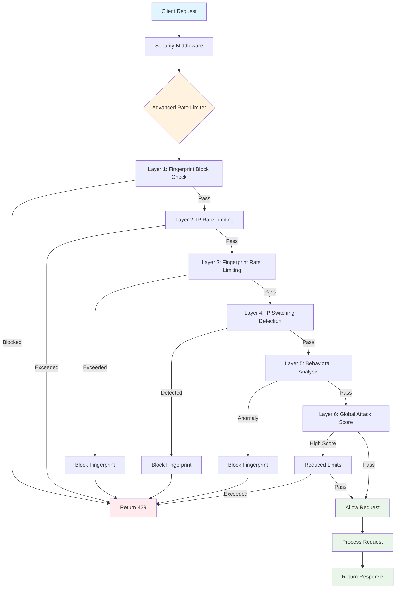

## 🔄 Flow Diagram Lengkap

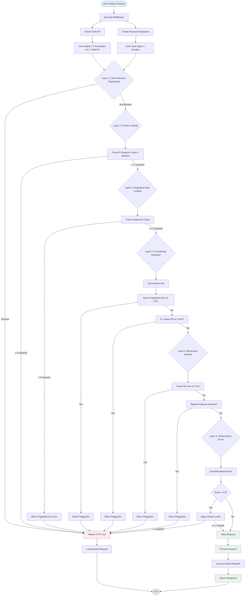

## 🔍 Request Fingerprinting Process

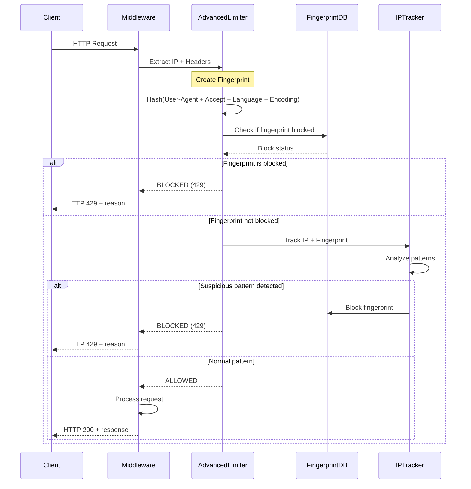

## 🎛️ Configuration & Tuning

### 📊 Default Settings

```python
# Rate Limiting Configuration
WINDOW_SIZE = 60  # 1 minute
MAX_REQUESTS_PER_IP = 10
MAX_FINGERPRINT_REQUESTS = 3  # Strict fingerprint limit
SUSPICIOUS_IP_CHANGES_THRESHOLD = 5  # IPs in short time
ATTACK_BLOCK_DURATION = 300  # 5 minutes

# Attack Detection Thresholds
IP_SWITCHING_THRESHOLD = 3  # Same fingerprint from 3+ IPs
GLOBAL_ATTACK_THRESHOLD = 0.8  # Attack score threshold
BOT_BEHAVIOR_VARIANCE = 0.1  # Request timing variance
```

### ⚙️ Tuning Guidelines

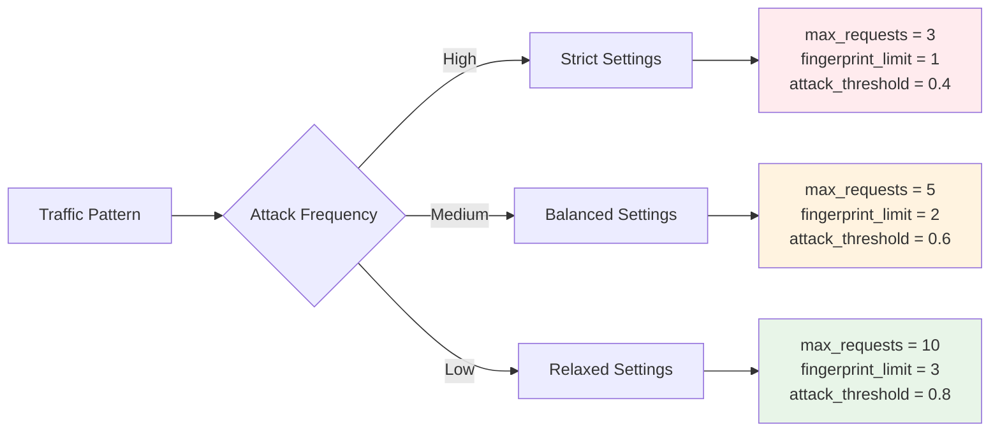

## 🔬 Detection Algorithms

### 1. IP Switching Detection

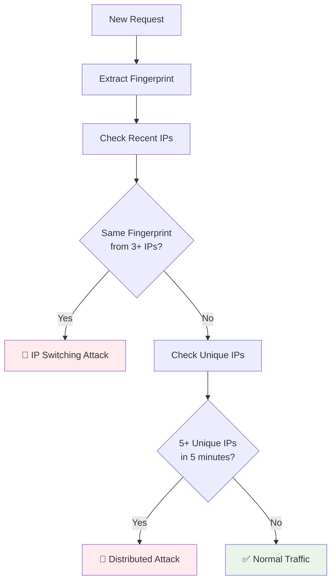

### 2. Behavioral Analysis

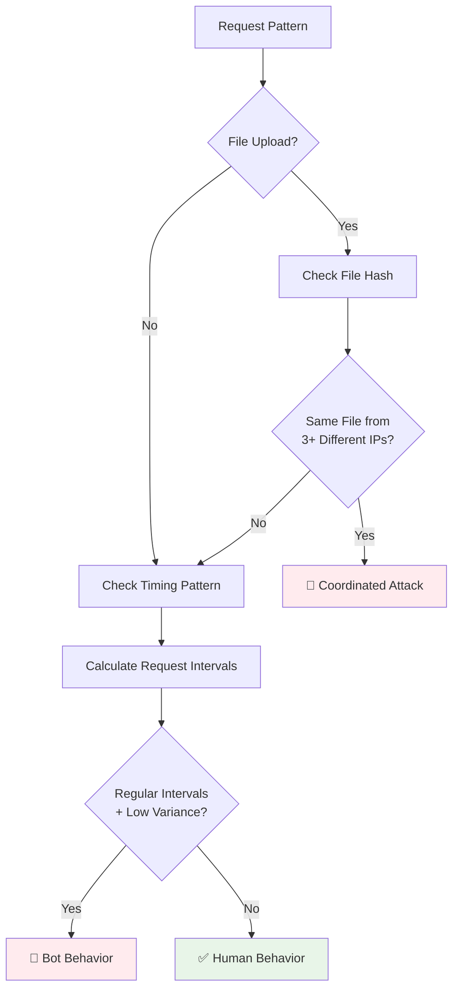

### 3. Global Attack Scoring

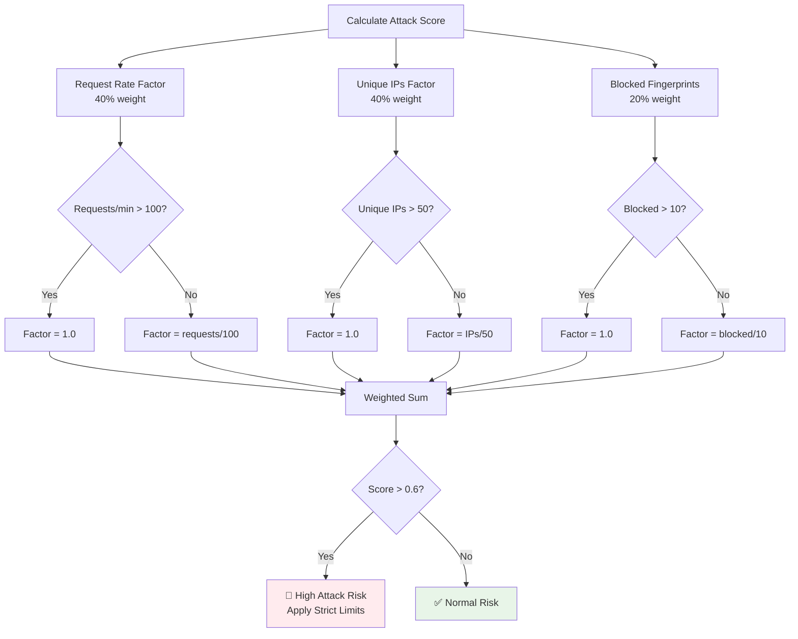

## 🧪 Testing Scenarios

### Test Coverage Matrix

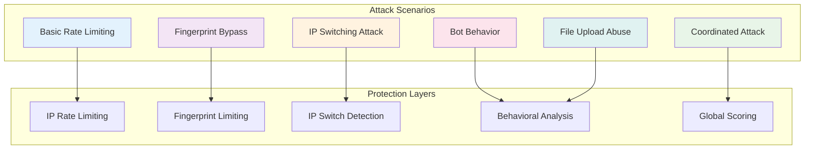

### Test Results Interpretation

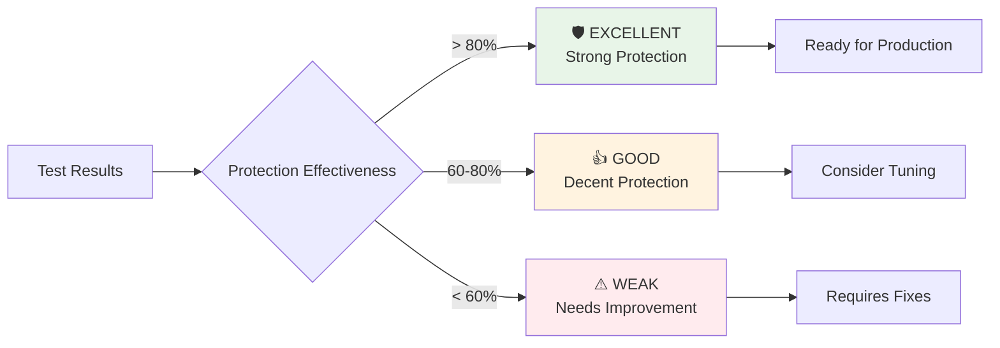

## 📈 Performance Impact

### Resource Usage Analysis

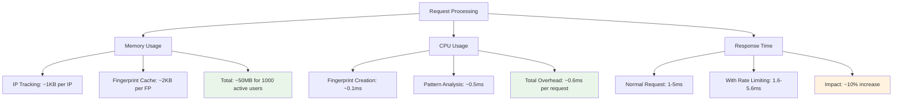

## 🔧 Implementation Details

### File Structure

```
app/
├── core/
│   ├── advanced_rate_limiting.py  # Main implementation
│   └── settings.py               # Configuration
├── middleware/
│   └── security.py              # Middleware integration
├── api/
│   └── security.py              # Security endpoints
└── utils/
    └── security.py              # Helper functions
```

### Key Classes

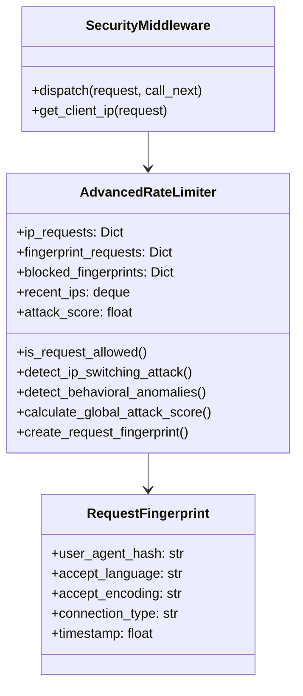

## 🚀 Usage Examples

### 1. Basic Implementation

```python
from app.core.advanced_rate_limiting import advanced_rate_limiter

# Check if request is allowed
is_allowed, reason, details = advanced_rate_limiter.is_request_allowed(
    client_ip="192.168.1.100",
    endpoint="/api/predict",
    request=request,
    file_hash=file_hash
)

if not is_allowed:
    return JSONResponse(
        status_code=429,
        content={"error": reason, "details": details}
    )
```

### 2. Security Status Monitoring

```python
# Get current security status
status = advanced_rate_limiter.get_security_status()
print(f"Attack Score: {status['global_attack_score']}")
print(f"Active IPs: {status['active_ips']}")
print(f"Blocked Fingerprints: {status['blocked_fingerprints']}")
```

### 3. Custom Configuration

```python
# Adjust thresholds for high-security environment
advanced_rate_limiter.max_requests_per_ip = 3
advanced_rate_limiter.max_fingerprint_requests = 1
advanced_rate_limiter.suspicious_ip_changes_threshold = 3
```

## 📊 Monitoring & Alerting

### Key Metrics to Monitor

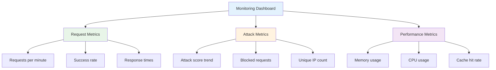

### Alert Thresholds

| Metric | Warning | Critical |
|--------|---------|----------|
| Attack Score | > 0.7 | > 0.9 |
| Blocked Rate | > 20% | > 50% |
| Unique IPs/min | > 10 | > 20 |
| Response Time | > 100ms | > 500ms |

## 🎯 Best Practices

### 1. Security Configuration

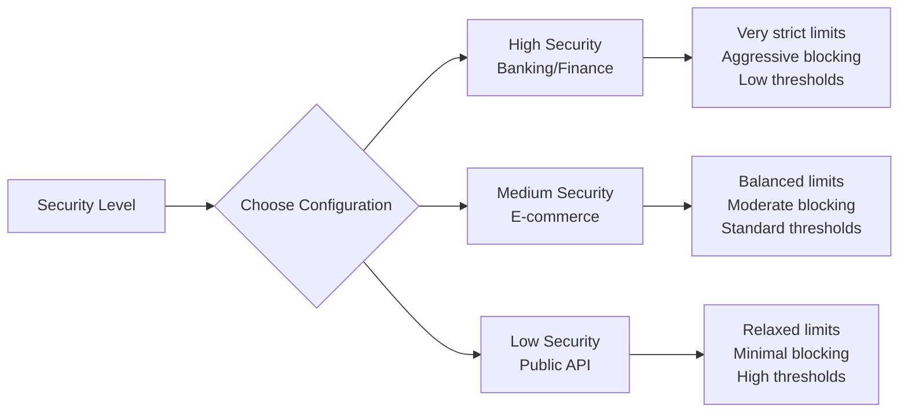

### 2. Deployment Considerations

- **Load Balancer**: Ensure proper IP forwarding headers
- **CDN**: Configure to pass through client IPs
- **Monitoring**: Set up alerts for attack patterns
- **Logging**: Enable detailed security logging
- **Backup**: Implement fallback rate limiting

### 3. Maintenance Tasks

- **Weekly**: Review blocked fingerprints
- **Monthly**: Analyze attack patterns
- **Quarterly**: Tune detection thresholds
- **Annually**: Security audit and updates

## 🔍 Troubleshooting

### Common Issues

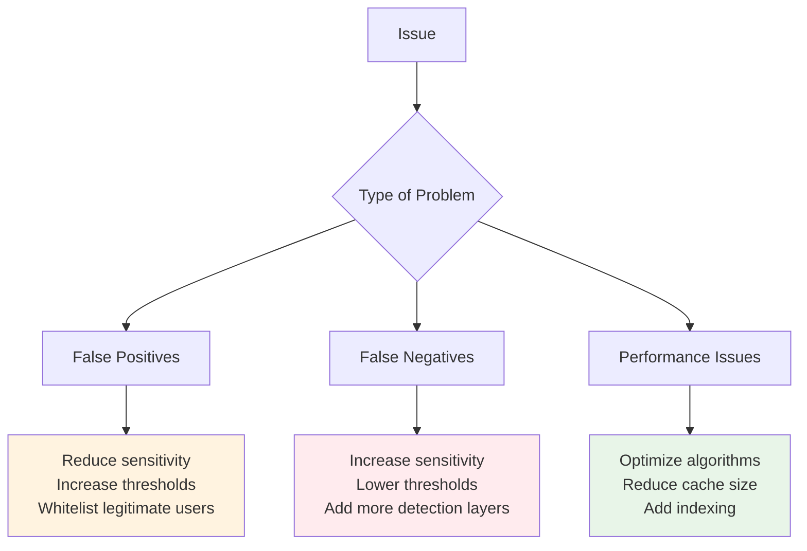

## 📚 References

- [OWASP Rate Limiting Guide](https://owasp.org/www-community/controls/Blocking_Brute_Force_Attacks)
- [RFC 6585 - HTTP Status Code 429](https://tools.ietf.org/html/rfc6585)
- [CloudFlare Rate Limiting](https://developers.cloudflare.com/fundamentals/api/get-started/requests-per-minute/)
- [NIST Cybersecurity Framework](https://www.nist.gov/cyberframework)

---

**🛡️ Advanced Rate Limiting Implementation**  
*Protecting APIs from sophisticated attacks with multi-layer security*

**Version**: 3.0.0  
**Last Updated**: August 23, 2025  
**Author**: IbnuSabilGitHub
