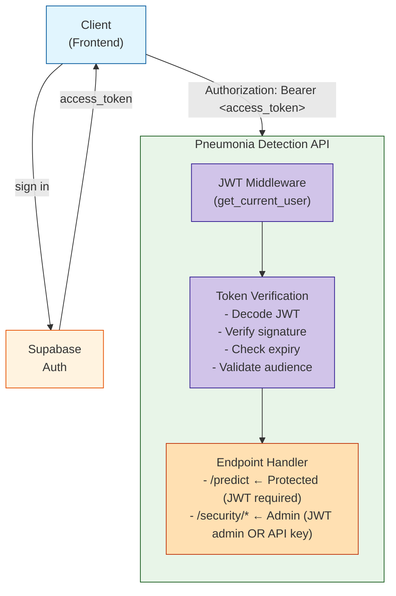

# 🔐 Supabase JWT Authentication Guide

Panduan lengkap integrasi **JWT Authentication** menggunakan **Supabase** pada Pneumonia Detection API.

---

## 📚 Daftar Isi

- [Overview](#overview)
- [Arsitektur Autentikasi](#arsitektur-autentikasi)
- [Endpoint Protection Matrix](#endpoint-protection-matrix)
- [Setup Supabase](#setup-supabase)
- [Konfigurasi Environment](#konfigurasi-environment)
- [Cara Kerja JWT Flow](#cara-kerja-jwt-flow)
- [Dependency Injection](#dependency-injection)
- [Usage Examples](#usage-examples)
- [Admin Authentication](#admin-authentication)
- [Error Responses](#error-responses)
- [Security Best Practices](#security-best-practices)
- [Troubleshooting](#troubleshooting)
- [Migration Guide](#migration-guide)

---

## Overview

API ini menggunakan **Supabase** sebagai identity provider dengan **JWT (JSON Web Token)** untuk autentikasi. Supabase menangani seluruh manajemen user (sign up, sign in, password reset, OAuth, dll.), sedangkan API hanya memverifikasi token yang diterbitkan oleh Supabase.

**Mengapa Supabase + JWT?**

| Aspek | Penjelasan |
|---|---|
| **Stateless** | Tidak perlu session store; token berisi semua informasi yang diperlukan |
| **Scalable** | Verifikasi token di masing-masing instance tanpa shared state |
| **Standards-based** | Mengikuti RFC 7519 (JWT) dan OAuth 2.0 Bearer Token |
| **Managed auth** | Supabase menangani user management, email verification, OAuth providers |
| **Role-based** | Mendukung role dari `app_metadata` dan `user_metadata` |

---

## Arsitektur Autentikasi



---

## Endpoint Protection Matrix

| Endpoint | Method | Auth Required | Auth Type | Keterangan |
|---|---|---|---|---|
| `/` | GET | ❌ | Public | Health check |
| `/health` | GET | ❌ | Public | Health check (alt) |
| `/docs` | GET | ❌ | Public | API documentation |
| `/redoc` | GET | ❌ | Public | API documentation |
| `/pneumonia/model/info` | GET | ❌ | Public | Model metadata |
| `/pneumonia/predict` | POST | ✅ | **JWT Bearer** | Core prediction |
| `/security/status` | GET | ✅ | **JWT Admin** OR **API Key** | Security status |
| `/security/stats` | GET | ✅ | **JWT Admin** OR **API Key** | Security analytics |

---

## Setup Supabase

### 1. Buat Project Supabase

1. Buka [supabase.com](https://supabase.com) dan buat akun
2. Klik **New Project**
3. Isi nama project, password database, dan pilih region terdekat
4. Tunggu project selesai dibuat

### 2. Ambil Credentials

Setelah project aktif, buka **Settings -> API**:

| Setting | Lokasi | Contoh |
|---|---|---|
| **Project URL** | Settings -> API -> Project URL | `https://abcdefg.supabase.co` |
| **JWT Secret** | Settings -> API -> JWT Secret | `super-secret-jwt-token-...` |
| **Anon Key** | Settings -> API -> Project API Keys | `eyJhbGciOiJIUzI1NiIs...` |

> ⚠️ **PENTING**: JWT Secret adalah kunci rahasia. **JANGAN** pernah commit ke repository.

### 3. (Opsional) Konfigurasi Role Admin

Untuk memberikan akses admin ke user tertentu, update `app_metadata` via Supabase Dashboard atau SQL:

```sql
-- Via Supabase SQL Editor
UPDATE auth.users
SET raw_app_meta_data = raw_app_meta_data || '{"role": "admin"}'::jsonb
WHERE email = 'admin@example.com';
```

Atau via Supabase Admin API:

```bash
curl -X PUT "https://<project>.supabase.co/auth/v1/admin/users/<user_id>" \
  -H "Authorization: Bearer <service_role_key>" \
  -H "Content-Type: application/json" \
  -d '{"app_metadata": {"role": "admin"}}'
```

---

## Konfigurasi Environment

### Minimal (Wajib)

```bash
# Aktifkan JWT authentication
JWT_AUTH_ENABLED=true

# Supabase JWT Secret (dari Settings -> API -> JWT Secret)
SUPABASE_JWT_SECRET=your-supabase-jwt-secret-here
```

### Lengkap (Semua Opsi)

```bash
# JWT Authentication Configuration

# Master toggle — set true untuk mengaktifkan JWT auth
JWT_AUTH_ENABLED=true

# Supabase project URL (opsional, untuk referensi)
SUPABASE_URL=https://your-project.supabase.co

# JWT Secret (WAJIB jika JWT_AUTH_ENABLED=true)
# Ambil dari: Supabase Dashboard -> Settings -> API -> JWT Secret
SUPABASE_JWT_SECRET=your-supabase-jwt-secret-here

# Supabase anon key (opsional, untuk referensi client-side)
SUPABASE_ANON_KEY=eyJhbGciOiJIUzI1NiIs...

# Algorithm JWT (default: ES256, sesuai Supabase default)
JWT_ALGORITHM=ES256


# Verify audience claim (default: true)
SUPABASE_JWT_VERIFY_AUDIENCE=true

# Legacy Admin API Key (tetap berfungsi)
ADMIN_API_KEY=your-secure-admin-api-key-here
```

### Contoh File `.env`

```env
# Application
APP_VERSION=3.5.1
DEBUG=false
PORT=8000

# JWT Auth (Supabase)
JWT_AUTH_ENABLED=true
SUPABASE_URL=https://abcdefg.supabase.co
SUPABASE_JWT_SECRET=super-secret-jwt-token-with-at-least-32-characters-long
JWT_ALGORITHM=ES256

# Admin (legacy + JWT)
ADMIN_API_KEY=your-legacy-admin-key

# Storage
STORAGE_BACKEND=memory
```

---

## Cara Kerja JWT Flow

### 1. User Sign In (di Client/Frontend)

```javascript
// Supabase JS Client
import { createClient } from '@supabase/supabase-js'

const supabase = createClient(SUPABASE_URL, SUPABASE_ANON_KEY)

// Sign in
const { data, error } = await supabase.auth.signInWithPassword({
  email: 'user@example.com',
  password: 'securepassword'
})

// data.session.access_token -> ini yang dikirim ke API
console.log(data.session.access_token)
```

### 2. Request ke API

```bash
curl -X POST "http://localhost:8000/pneumonia/predict" \
  -H "Authorization: Bearer <access_token>" \
  -H "Content-Type: multipart/form-data" \
  -F "file=@chest_xray.jpg"
```

### 3. Verifikasi di API

```
Request masuk
    │
    ▼
Bearer token diekstrak dari header Authorization
    │
    ▼
Token di-decode menggunakan SUPABASE_JWT_SECRET
    │
    ├── Signature valid?      -> Lanjut
    ├── Token expired?        -> 401 TOKEN_EXPIRED
    ├── Audience cocok?       -> Lanjut (jika verify_audience=true)
    └── Claims lengkap?       -> Lanjut (sub, exp, iat wajib ada)
    │
    ▼
JWTPayload object dibuat (user_id, email, role)
    │
    ▼
Endpoint handler menerima user object via Dependency Injection
```

### Contoh JWT Payload dari Supabase

```json
{
  "aud": "authenticated",
  "exp": 1709312400,
  "iat": 1709308800,
  "iss": "https://abcdefg.supabase.co/auth/v1",
  "sub": "a1b2c3d4-e5f6-7890-abcd-ef1234567890",
  "email": "user@example.com",
  "role": "authenticated",
  "app_metadata": {
    "provider": "email",
    "role": "admin"
  },
  "user_metadata": {
    "full_name": "John Doe"
  }
}
```

---

## Dependency Injection

### Dependencies yang Tersedia

| Dependency | Import Path | Keterangan |
|---|---|---|
| `get_current_user` | `app.utils.jwt_auth` | Wajib authenticated (401 jika tidak ada token) |
| `get_optional_user` | `app.utils.jwt_auth` | Opsional (return `None` jika tidak ada token) |
| `get_admin_user` | `app.utils.jwt_auth` | Wajib authenticated + admin role (403 jika bukan admin) |
| `verify_admin_jwt_or_api_key` | `app.utils.jwt_auth` | Admin JWT **atau** legacy API key |

### Contoh Penggunaan di Endpoint

```python
from fastapi import APIRouter, Depends
from app.utils.jwt_auth import (
    JWTPayload,
    get_current_user,
    get_optional_user,
    get_admin_user,
)

router = APIRouter()


# Endpoint yang wajib login
@router.post("/protected")
async def protected_endpoint(user: JWTPayload = Depends(get_current_user)):
    return {"message": f"Hello {user.email}", "user_id": user.user_id}


# Endpoint dengan auth opsional
@router.get("/public-or-private")
async def optional_auth(user: JWTPayload | None = Depends(get_optional_user)):
    if user:
        return {"message": f"Hello {user.email}"}
    return {"message": "Hello anonymous"}


# Endpoint khusus admin
@router.get("/admin-only")
async def admin_endpoint(admin: JWTPayload = Depends(get_admin_user)):
    return {"message": f"Admin access granted for {admin.email}"}
```

### JWTPayload Object

```python
class JWTPayload:
    sub: str           # Supabase user ID (UUID)
    email: str | None  # User email
    role: str          # Supabase role (e.g. "authenticated")
    raw: dict          # Complete decoded JWT payload

    @property
    def user_id(self) -> str     # Alias untuk sub
    @property
    def is_admin(self) -> bool   # Cek admin dari role/app_metadata/user_metadata
```

---

## Usage Examples

### cURL

```bash
# 1. Sign in ke Supabase (mendapatkan access_token)
TOKEN=$(curl -s -X POST "https://<project>.supabase.co/auth/v1/token?grant_type=password" \
  -H "apikey: <anon_key>" \
  -H "Content-Type: application/json" \
  -d '{"email": "user@example.com", "password": "password123"}' \
  | jq -r '.access_token')

# 2. Prediksi pneumonia (JWT required)
curl -X POST "http://localhost:8000/pneumonia/predict" \
  -H "Authorization: Bearer $TOKEN" \
  -F "file=@chest_xray.jpg"

# 3. Security status (admin JWT)
curl -X GET "http://localhost:8000/security/status" \
  -H "Authorization: Bearer $ADMIN_TOKEN"

# 4. Security status (legacy API key — masih berfungsi)
curl -X GET "http://localhost:8000/security/status" \
  -H "X-Admin-API-Key: your-admin-api-key"
```

### Python (requests)

```python
import requests

SUPABASE_URL = "https://your-project.supabase.co"
SUPABASE_ANON_KEY = "eyJ..."
API_URL = "http://localhost:8000"


# Step 1: Sign in
auth_resp = requests.post(
    f"{SUPABASE_URL}/auth/v1/token?grant_type=password",
    headers={"apikey": SUPABASE_ANON_KEY, "Content-Type": "application/json"},
    json={"email": "user@example.com", "password": "password123"},
    timeout=10,
)
access_token = auth_resp.json()["access_token"]

# Step 2: Prediksi
with open("chest_xray.jpg", "rb") as f:
    resp = requests.post(
        f"{API_URL}/pneumonia/predict",
        headers={"Authorization": f"Bearer {access_token}"},
        files={"file": ("chest_xray.jpg", f, "image/jpeg")},
        timeout=30,
    )
print(resp.json())
```

### JavaScript (Supabase JS + fetch)

```javascript
import { createClient } from '@supabase/supabase-js'

const supabase = createClient(SUPABASE_URL, SUPABASE_ANON_KEY)
const API_URL = 'http://localhost:8000'

// Step 1: Sign in
const { data: { session } } = await supabase.auth.signInWithPassword({
  email: 'user@example.com',
  password: 'password123'
})

// Step 2: Prediksi
const formData = new FormData()
formData.append('file', fileInput.files[0])

const response = await fetch(`${API_URL}/pneumonia/predict`, {
  method: 'POST',
  headers: {
    'Authorization': `Bearer ${session.access_token}`
  },
  body: formData
})

const result = await response.json()
console.log(result)
```

### Python (async dengan httpx)

```python
import httpx

async def predict_with_auth():
    async with httpx.AsyncClient() as client:
        # Sign in
        auth = await client.post(
            f"{SUPABASE_URL}/auth/v1/token?grant_type=password",
            headers={"apikey": SUPABASE_ANON_KEY},
            json={"email": "user@example.com", "password": "password123"},
        )
        token = auth.json()["access_token"]

        # Predict
        with open("chest_xray.jpg", "rb") as f:
            resp = await client.post(
                f"{API_URL}/pneumonia/predict",
                headers={"Authorization": f"Bearer {token}"},
                files={"file": ("chest_xray.jpg", f, "image/jpeg")},
            )
        return resp.json()
```

---

## Admin Authentication

Endpoint admin (`/security/status`, `/security/stats`) mendukung **dua metode** autentikasi:

### Metode 1: JWT dengan Admin Role (Baru)

```bash
# User harus memiliki app_metadata.role = "admin" di Supabase
curl -X GET "http://localhost:8000/security/status" \
  -H "Authorization: Bearer <admin_access_token>"
```

### Metode 2: Legacy API Key (Backward Compatible)

```bash
curl -X GET "http://localhost:8000/security/status" \
  -H "X-Admin-API-Key: your-admin-api-key"
```

### Bagaimana Admin Role Ditentukan?

`JWTPayload.is_admin` memeriksa tiga lokasi:

1. **Top-level `role`**: `"service_role"` atau `"admin"`
2. **`app_metadata.role`**: `"admin"` atau `"service_role"`
3. **`user_metadata.role`**: `"admin"` atau `"service_role"`

Jika salah satu cocok -> user dianggap admin.

### Prioritas Autentikasi Admin

```
1. Cek JWT Bearer token -> jika ada dan valid:
   ├── Cek is_admin -> granted
   └── Bukan admin -> 403 ADMIN_REQUIRED
2. Cek X-Admin-API-Key header -> jika cocok -> granted
3. Tidak ada credential -> 401 MISSING_CREDENTIALS
```

---

## Error Responses

### 401 Unauthorized

```json
{
  "detail": {
    "error": "Missing authentication",
    "error_code": "MISSING_TOKEN",
    "message": "Authorization header with Bearer token is required.",
    "hint": "Add header: Authorization: Bearer <your_supabase_access_token>"
  }
}
```

### 401 Token Expired

```json
{
  "detail": {
    "error": "Token expired",
    "error_code": "TOKEN_EXPIRED",
    "message": "Your session has expired. Please sign in again."
  }
}
```

### 401 Invalid Token

```json
{
  "detail": {
    "error": "Invalid token",
    "error_code": "INVALID_TOKEN",
    "message": "The provided token is malformed or invalid."
  }
}
```

### 403 Forbidden (Admin Required)

```json
{
  "detail": {
    "error": "Insufficient permissions",
    "error_code": "ADMIN_REQUIRED",
    "message": "This endpoint requires admin privileges.",
    "current_role": "authenticated"
  }
}
```

### 503 Auth Not Configured

```json
{
  "detail": {
    "error": "Authentication service not configured",
    "error_code": "AUTH_NOT_CONFIGURED",
    "message": "Contact administrator to configure JWT authentication"
  }
}
```

### 503 Auth Disabled

```json
{
  "detail": {
    "error": "JWT authentication disabled",
    "error_code": "AUTH_DISABLED",
    "message": "JWT authentication is not enabled on this instance."
  }
}
```

### Daftar Error Codes

| Code | HTTP Status | Keterangan |
|---|---|---|
| `MISSING_TOKEN` | 401 | Header Authorization tidak ada |
| `INVALID_TOKEN` | 401 | Token tidak valid / malformed |
| `TOKEN_EXPIRED` | 401 | Token sudah expired |
| `INVALID_AUDIENCE` | 401 | Audience token tidak cocok |
| `TOKEN_VALIDATION_FAILED` | 401 | Validasi token gagal (umum) |
| `AUTH_NOT_CONFIGURED` | 503 | JWT secret belum dikonfigurasi |
| `AUTH_DISABLED` | 503 | JWT auth dinonaktifkan |
| `ADMIN_REQUIRED` | 403 | User bukan admin |
| `MISSING_CREDENTIALS` | 401 | Tidak ada JWT atau API key |

---

## Security Best Practices

### 1. Environment Variables

```bash
# JANGAN hardcode secret di code
# BAIK: gunakan environment variable
SUPABASE_JWT_SECRET=your-secret-here

# JANGAN commit .env ke git
echo ".env" >> .gitignore
```

### 2. Token Handling di Client

```javascript
// BAIK: Gunakan Supabase SDK (auto-refresh)
const { data: { session } } = await supabase.auth.getSession()

// BAIK: Handle token expired
supabase.auth.onAuthStateChange((event, session) => {
  if (event === 'TOKEN_REFRESHED') {
    // Update token yang disimpan
  }
  if (event === 'SIGNED_OUT') {
    // Redirect ke login
  }
})

// JANGAN: Simpan token di localStorage tanpa enkripsi
// JANGAN: Kirim token via query parameter
```

### 3. CORS Configuration

```bash
# Production: batasi origin
CORS_ORIGINS=https://yourdomain.com,https://app.yourdomain.com

# Development only
CORS_ORIGINS=*
```

### 4. Token Expiry

Supabase default token expiry: **1 jam**. Konfigurasi di Supabase Dashboard -> Settings -> Auth -> JWT expiry.

Rekomendasi:
- **Access token**: 1 jam (default)
- **Refresh token**: 7 hari
- Client harus implement auto-refresh

### 5. Audit Logging

Setiap request yang ter-autentikasi di-log dengan user ID:

```
Prediction OK | user=a1b2c3d4-... ip=127.0.0.1 file=xray.jpg ...
```

---

## Troubleshooting

### JWT Auth Tidak Bekerja

```bash
# Cek apakah JWT_AUTH_ENABLED=true
curl http://localhost:8000/health | jq

# Cek log startup
# Harus muncul: "JWT auth enabled: True"
# Harus muncul: "Supabase JWT secret: configured"
```

### Token Selalu Invalid

```bash
# 1. Pastikan JWT_ALGORITHM cocok (default HS256)
JWT_ALGORITHM=HS256

# 2. Pastikan JWT secret benar (copy dari Supabase Dashboard)
# Settings -> API -> JWT Secret (bukan anon key!)

# 3. Test decode manual
python -c "
import jwt
token = 'your_token_here'
secret = 'your_jwt_secret_here'
print(jwt.decode(token, secret, algorithms=['HS256'], audience='authenticated'))
"
```

### Admin Access Ditolak

```sql
-- Cek app_metadata user di Supabase
SELECT id, email, raw_app_meta_data
FROM auth.users
WHERE email = 'admin@example.com';

-- Tambahkan admin role
UPDATE auth.users
SET raw_app_meta_data = raw_app_meta_data || '{"role": "admin"}'::jsonb
WHERE email = 'admin@example.com';
```

### Audience Error

```bash
# Supabase default audience: "authenticated"
# Jika menggunakan custom audience, set:
SUPABASE_JWT_VERIFY_AUDIENCE=false
# Atau sesuaikan audience di Supabase settings
```

---

## Migration Guide

### Dari API Key Only -> JWT + API Key

**Sebelum** (API key saja):
```bash
ADMIN_API_KEY=my-secret-key

# Request:
curl -H "X-Admin-API-Key: my-secret-key" http://localhost:8000/security/status
```

**Sesudah** (JWT + API key — backward compatible):
```bash
# Tambahkan JWT config
JWT_AUTH_ENABLED=true
SUPABASE_JWT_SECRET=your-jwt-secret

# API key masih berfungsi!
ADMIN_API_KEY=my-secret-key

# Request lama masih jalan:
curl -H "X-Admin-API-Key: my-secret-key" http://localhost:8000/security/status

# Request baru dengan JWT juga jalan:
curl -H "Authorization: Bearer <admin_jwt>" http://localhost:8000/security/status
```

### Dari Unprotected Predict -> JWT Protected

**Sebelum**:
```bash
# Tanpa auth
curl -X POST http://localhost:8000/pneumonia/predict -F "file=@xray.jpg"
```

**Sesudah**:
```bash
# Wajib JWT
curl -X POST http://localhost:8000/pneumonia/predict \
  -H "Authorization: Bearer <access_token>" \
  -F "file=@xray.jpg"
```

### Rollback (Disable JWT)

Jika perlu menonaktifkan JWT authentication:

```bash
JWT_AUTH_ENABLED=false
```

Ketika `JWT_AUTH_ENABLED=false`:
- `/pneumonia/predict` -> return 503 AUTH_DISABLED
- `/security/*` -> fallback ke API key only

---

## File Structure

```
app/
├── utils/
│   ├── auth.py              # Legacy API key auth (tetap ada)
│   └── jwt_auth.py          # NEW: Supabase JWT auth
├── models/
│   ├── auth_schemas.py      # NEW: Auth Pydantic schemas
│   └── error_codes.py       # Updated: auth error codes
├── core/
│   └── settings.py          # Updated: JWT settings
├── api/
│   ├── prediction.py        # Updated: JWT protection
│   ├── stats.py             # Updated: JWT + API key
│   └── status.py            # Updated: JWT + API key
└── openapi.py               # Updated: security schemes
```

---

## Referensi

- [Supabase Auth Docs](https://supabase.com/docs/guides/auth)
- [Supabase JWT Settings](https://supabase.com/docs/guides/auth/jwts)
- [PyJWT Documentation](https://pyjwt.readthedocs.io/)
- [FastAPI Security](https://fastapi.tiangolo.com/tutorial/security/)
- [RFC 7519 - JSON Web Token](https://datatracker.ietf.org/doc/html/rfc7519)
- [OWASP Authentication Cheatsheet](https://cheatsheetseries.owasp.org/cheatsheets/Authentication_Cheat_Sheet.html)
