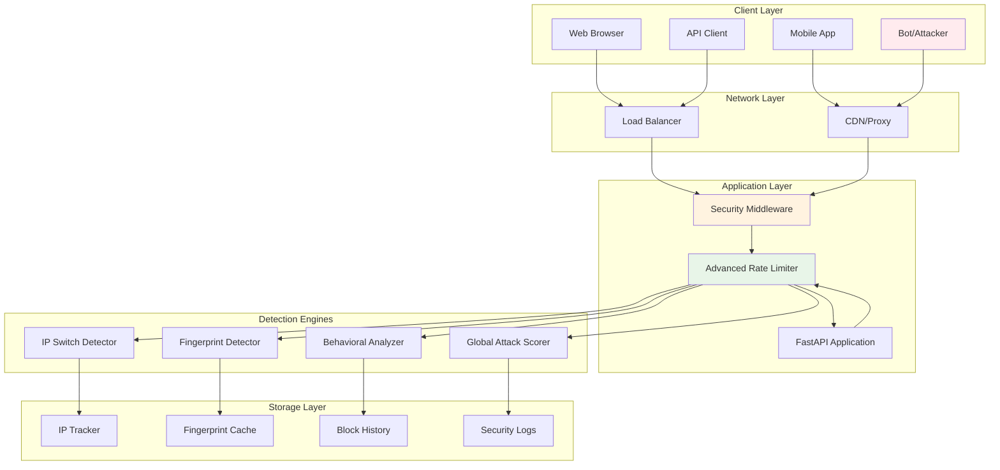
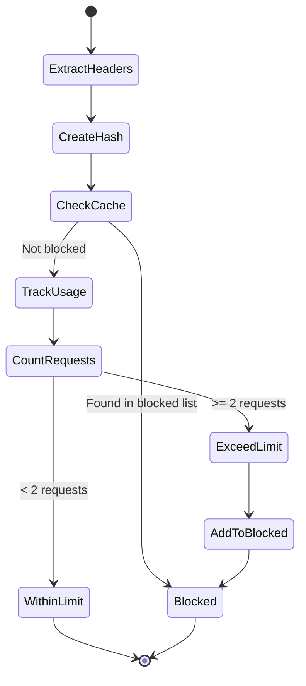
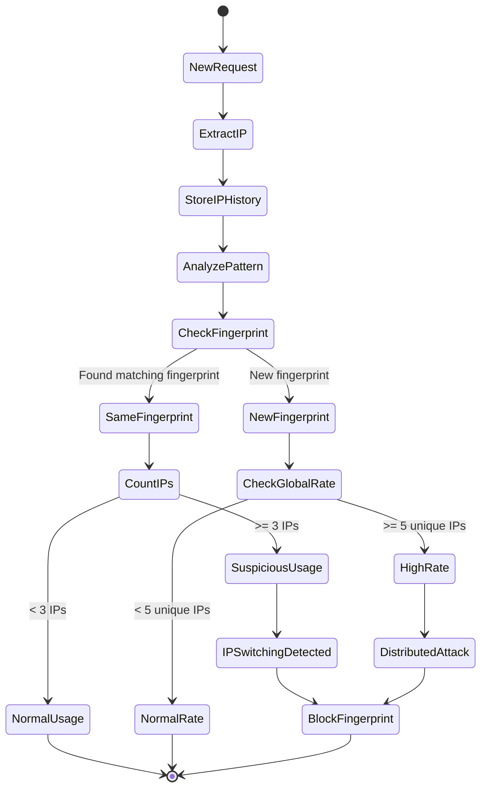
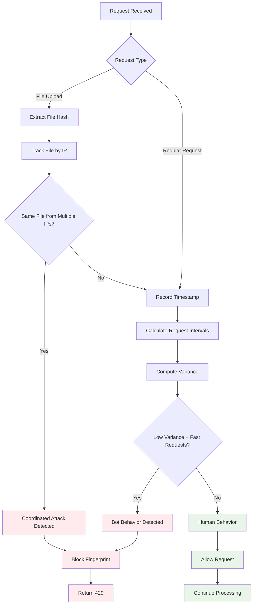
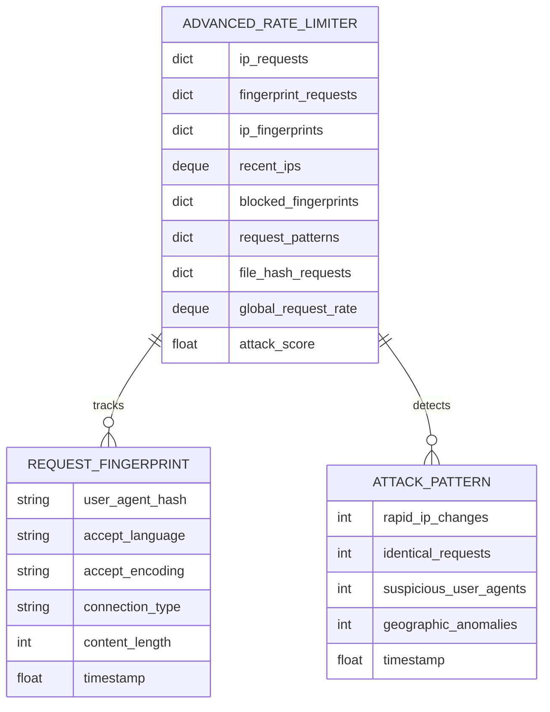
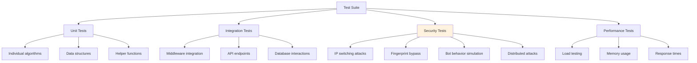
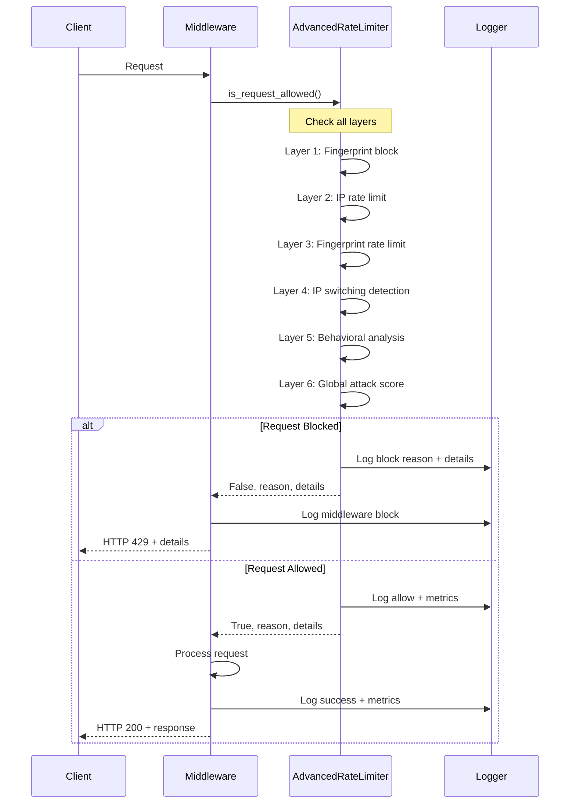

# 🔧 Technical Implementation Guide

## 📋 Quick Start

### 1. Installation & Setup

```bash
# Clone repository
git clone https://github.com/IbnuSabilGitHub/Pneumonia-Detection-API.git
cd Pneumonia-Detection-API

# Setup virtual environment
python -m venv .venv
.venv\Scripts\activate  # Windows
# source .venv/bin/activate  # Linux/Mac

# Install dependencies
pip install -r requirements.txt

# Start server
python main.py
# or
fastapi dev main.py
```

### 2. Verify Advanced Rate Limiting

```bash
# Test basic endpoint
curl http://localhost:8000/security/status

# Test advanced protection
python test_ip_switching_attack.py
```

## 🏗️ Architecture Deep Dive

### System Components Flow



## 🔍 Detection Engine Details

### 1. Fingerprint Detection Engine



### 2. IP Switching Detection Engine



### 3. Behavioral Analysis Engine



## 📊 Data Structures & Algorithms

### Core Data Structures



### Algorithm Complexity

| Operation | Time Complexity | Space Complexity | Notes |
|-----------|----------------|------------------|-------|
| Fingerprint Creation | O(1) | O(1) | SHA-256 hash |
| IP Rate Check | O(1) amortized | O(n) | Deque cleanup |
| Fingerprint Check | O(1) amortized | O(m) | Dict lookup |
| IP Switch Detection | O(k) | O(k) | k = recent IPs |
| Behavioral Analysis | O(h) | O(h) | h = request history |
| Global Score Calc | O(1) | O(1) | Weighted factors |

Where:
- n = requests per IP in window
- m = fingerprints in system  
- k = recent unique IPs (max 1000)
- h = request history per IP (max 10)

## 🔒 Security Implementation Details

### Request Fingerprint Algorithm

```python
def create_request_fingerprint(self, request) -> str:
    """
    Create unique fingerprint from request headers.
    
    Algorithm:
    1. Extract key headers (User-Agent, Accept, etc.)
    2. Normalize and concatenate
    3. Generate SHA-256 hash
    4. Return first 16 characters (64-bit equivalent)
    """
    headers = request.headers
    
    # Key headers for fingerprinting
    components = [
        headers.get("user-agent", ""),
        headers.get("accept-language", ""),
        headers.get("accept-encoding", ""),
        headers.get("accept", ""),
        headers.get("connection", "")
    ]
    
    # Create composite fingerprint
    fingerprint_data = "|".join(components)
    fingerprint_hash = hashlib.sha256(fingerprint_data.encode()).hexdigest()[:16]
    
    return fingerprint_hash
```

### IP Switching Detection Algorithm

```python
def detect_ip_switching_attack(self, client_ip: str, fingerprint: str) -> bool:
    """
    Detect IP switching attack patterns.
    
    Detection Criteria:
    1. Same fingerprint from 3+ different IPs
    2. 5+ unique IPs in 5-minute window (distributed attack)
    
    Algorithm Complexity: O(k) where k = recent IPs
    """
    current_time = time.time()
    
    # Track recent IPs with timestamps
    self.recent_ips.append((client_ip, current_time))
    
    # Clean old entries (5 minutes ago)
    cutoff_time = current_time - 300
    while self.recent_ips and self.recent_ips[0][1] < cutoff_time:
        self.recent_ips.popleft()
    
    # Count unique IPs
    recent_unique_ips = len(set(ip for ip, _ in self.recent_ips))
    
    # Find IPs using same fingerprint
    fingerprint_ips = [
        ip for ip, ts in self.recent_ips 
        if any(fp.user_agent_hash == fingerprint 
               for fp in self.ip_fingerprints.get(ip, []))
    ]
    
    # Detection logic
    if len(set(fingerprint_ips)) > 3:  # Same fingerprint from 3+ IPs
        return True
        
    if recent_unique_ips > 5:  # 5+ unique IPs in window
        return True
        
    return False
```

### Global Attack Score Algorithm

```python
def calculate_global_attack_score(self) -> float:
    """
    Calculate global attack probability score.
    
    Score Components:
    - Request rate factor (40%): requests_per_minute / 100
    - Unique IPs factor (40%): unique_ips / 50  
    - Blocked fingerprints (20%): blocked_count / 10
    
    Returns: Float between 0.0 (no threat) and 1.0 (high threat)
    """
    current_time = time.time()
    
    # Add current request to global tracking
    self.global_request_rate.append(current_time)
    
    # Clean old entries (1 minute window)
    cutoff_time = current_time - 60
    while self.global_request_rate and self.global_request_rate[0] < cutoff_time:
        self.global_request_rate.popleft()
    
    # Calculate factors
    requests_per_minute = len(self.global_request_rate)
    unique_ips = len(set(ip for ip, _ in self.recent_ips))
    blocked_count = len(self.blocked_fingerprints)
    
    factors = {
        "request_rate": min(requests_per_minute / 100, 1.0),
        "unique_ips": min(unique_ips / 50, 1.0),
        "blocked_fingerprints": min(blocked_count / 10, 1.0)
    }
    
    # Weighted score
    self.attack_score = (
        factors["request_rate"] * 0.4 +
        factors["unique_ips"] * 0.4 +
        factors["blocked_fingerprints"] * 0.2
    )
    
    return self.attack_score
```

## 🧪 Testing Framework

### Test Categories



### Test Implementation Examples

```python
# Example: IP Switching Attack Test
def test_ip_switching_attack():
    """Test IP switching attack detection."""
    tester = IPSwitchingAttackTester()
    
    # Simulate attack with different IPs, same fingerprint
    results = []
    same_user_agent = "AttackBot/1.0"
    
    for i in range(10):
        fake_ip = f"192.168.{i+1}.100"
        headers = {
            'X-Forwarded-For': fake_ip,
            'User-Agent': same_user_agent
        }
        
        response = requests.get(url, headers=headers)
        results.append(response.status_code)
    
    # Should detect and block after 3-4 requests
    blocked_count = sum(1 for status in results if status == 429)
    assert blocked_count >= 6  # Most requests should be blocked
```

## 🚀 Deployment Guide

### Production Deployment Checklist

```mermaid
graph TD
    A[Deployment Checklist] --> B[Security Configuration]
    A --> C[Performance Tuning]
    A --> D[Monitoring Setup]
    A --> E[Testing Validation]
    
    B --> B1[✓ Rate limit thresholds set]
    B --> B2[✓ Attack detection tuned]
    B --> B3[✓ Logging configured]
    B --> B4[✓ SSL/TLS enabled]
    
    C --> C1[✓ Memory limits set]
    C --> C2[✓ Cache sizes optimized]
    C --> C3[✓ Cleanup intervals tuned]
    C --> C4[✓ Load balancer configured]
    
    D --> D1[✓ Metrics collection]
    D --> D2[✓ Alert thresholds]
    D --> D3[✓ Dashboard setup]
    D --> D4[✓ Log aggregation]
    
    E --> E1[✓ Attack simulation]
    E --> E2[✓ Load testing]
    E --> E3[✓ Failover testing]
    E --> E4[✓ Monitoring validation]
    
    style B1 fill:#e8f5e8
    style B2 fill:#e8f5e8
    style B3 fill:#e8f5e8
    style B4 fill:#e8f5e8
    style C1 fill:#e8f5e8
    style C2 fill:#e8f5e8
    style C3 fill:#e8f5e8
    style C4 fill:#e8f5e8
    style D1 fill:#e8f5e8
    style D2 fill:#e8f5e8
    style D3 fill:#e8f5e8
    style D4 fill:#e8f5e8
    style E1 fill:#e8f5e8
    style E2 fill:#e8f5e8
    style E3 fill:#e8f5e8
    style E4 fill:#e8f5e8
```



### Environment Configuration

```yaml
# Production Environment Variables
RATE_LIMIT_REQUESTS=5
RATE_LIMIT_WINDOW=60
FINGERPRINT_LIMIT=2
IP_SWITCH_THRESHOLD=3
ATTACK_SCORE_THRESHOLD=0.6
BLOCK_DURATION=300

# High Security Environment
RATE_LIMIT_REQUESTS=3
FINGERPRINT_LIMIT=1
IP_SWITCH_THRESHOLD=2
ATTACK_SCORE_THRESHOLD=0.4

# Development Environment
RATE_LIMIT_REQUESTS=10
FINGERPRINT_LIMIT=5
IP_SWITCH_THRESHOLD=10
ATTACK_SCORE_THRESHOLD=0.8
```

### Load Balancer Configuration

```nginx
# Nginx configuration for proper IP forwarding
upstream api_backend {
    server 127.0.0.1:8000;
    server 127.0.0.1:8001;
    server 127.0.0.1:8002;
}

server {
    listen 80;
    server_name api.example.com;
    
    location / {
        proxy_pass http://api_backend;
        
        # Important: Pass real client IP
        proxy_set_header X-Real-IP $remote_addr;
        proxy_set_header X-Forwarded-For $proxy_add_x_forwarded_for;
        proxy_set_header X-Forwarded-Proto $scheme;
        proxy_set_header Host $host;
        
        # Rate limiting at nginx level (additional protection)
        limit_req zone=api burst=10 nodelay;
    }
}

# Define rate limiting zone
http {
    limit_req_zone $binary_remote_addr zone=api:10m rate=30r/m;
}
```

### Docker Deployment

```dockerfile
# Dockerfile for production deployment
FROM python:3.11-slim

WORKDIR /app

# Install dependencies
COPY requirements.txt .
RUN pip install --no-cache-dir -r requirements.txt

# Copy application
COPY . .

# Security: Create non-root user
RUN useradd -m -u 1000 appuser && chown -R appuser:appuser /app
USER appuser

# Health check
HEALTHCHECK --interval=30s --timeout=30s --start-period=5s --retries=3 \
    CMD curl -f http://localhost:8000/ || exit 1

# Start application
CMD ["uvicorn", "app.main:app", "--host", "0.0.0.0", "--port", "8000"]
```

## 📈 Performance Optimization

### Memory Management

```mermaid
graph TD
    A[Memory Optimization] --> B[Cache Management]
    A --> C[Data Structure Optimization]
    A --> D[Garbage Collection]
    
    B --> B1[LRU Cache for fingerprints]
    B --> B2[Time-based cleanup]
    B --> B3[Memory limits per cache]
    
    C --> C1[Use deque for FIFO operations]
    C --> C2[Dict for O(1) lookups]
    C --> C3[Compact data structures]
    
    D --> D1[Periodic cleanup tasks]
    D --> D2[Weak references where possible]
    D --> D3[Manual cleanup triggers]
```

### Performance Tuning Parameters

```python
# Optimized settings for high-traffic environments
class OptimizedSettings:
    # Reduce memory footprint
    MAX_RECENT_IPS = 500  # Reduced from 1000
    MAX_FINGERPRINT_HISTORY = 100  # Limit fingerprint cache
    MAX_REQUEST_HISTORY = 5  # Reduced history per IP
    
    # Faster cleanup intervals
    CLEANUP_INTERVAL = 30  # Clean every 30 seconds
    
    # Optimized detection windows
    DETECTION_WINDOW = 30  # Reduced from 60 seconds
    
    # Batch processing
    BATCH_CLEANUP_SIZE = 50  # Process in batches
```

## 🔍 Debugging & Troubleshooting

### Debug Information Flow



### Common Issues & Solutions

| Issue | Symptom | Cause | Solution |
|-------|---------|-------|----------|
| False Positives | Legitimate users blocked | Thresholds too strict | Increase limits, tune thresholds |
| False Negatives | Attackers bypassing | Thresholds too loose | Decrease limits, add detection layers |
| High Memory Usage | RAM consumption growing | Cache not cleaned | Enable periodic cleanup |
| Slow Response | High latency | Complex calculations | Optimize algorithms, add caching |
| Log Spam | Too many log entries | Verbose logging | Adjust log levels |

### Debug Commands

```bash
# Check security status
curl http://localhost:8000/security/status | jq

# Get detailed stats
curl http://localhost:8000/security/stats | jq

# Monitor real-time logs
tail -f logs/security.log | grep "BLOCKED\|ATTACK"

# Test specific scenario
python test_ip_switching_attack.py --debug

# Performance profiling
python -m cProfile -o profile.stats main.py
```

---

**🔧 Technical Implementation Complete**  
*Advanced Rate Limiting with IP Switching Attack Protection*

For more information, see [ADVANCED_RATE_LIMITING_DOCS.md](./ADVANCED_RATE_LIMITING_DOCS.md)
